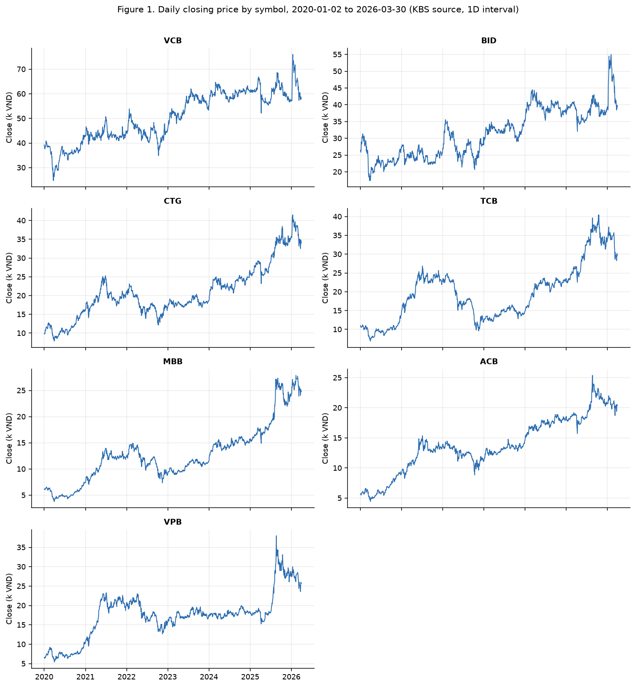
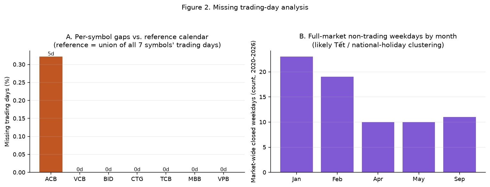
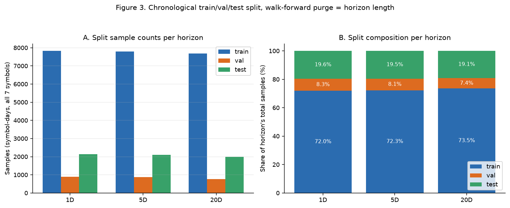

# Phase 1 — Market Data: Collection, Preprocessing, and Dataset Construction

## Abstract

This document describes the market-data component of Phase 1 of the thesis pipeline: the raw
data collected for seven Vietnamese banking equities, the preprocessing chain that converts raw
OHLCV bars into a model-ready tensor stream, and the chronological train/validation/test split
used to train and evaluate every baseline model. It covers the market modality only. The
Vietnamese financial-news collection, deduplication, and sentiment-encoding pipeline that
supplies the complementary text modality (used from Phase 2 onward) is documented separately and
is out of scope here, consistent with the requirement that this write-up focus on the data that
feeds the Phase 1 market-only baseline models. All figures and statistics below are computed
directly from the cached Phase 1 dataset and the persisted per-symbol scalers checked into this
repository (`cache/dataset/`, `artifacts/scaler_*.pkl`), not from illustrative or synthetic
numbers.

## 1. Scope and Reproducibility Context

- **Symbols (7):** `VCB`, `BID`, `CTG`, `TCB`, `MBB`, `ACB`, `VPB` — Vietnamese banking large- and
  mid-caps, chosen as a sector-homogeneous universe so that cross-sectional comparisons (Phase 2
  onward) are not confounded by sector effects.
- **Date range:** 2020-01-02 to 2026-03-30 (daily bars, `interval="1D"`).
- **Data source:** `vnstock` v3.x, `KBS` quote source (`src/pipeline/data_fetcher.py`).
- **Prediction horizons:** three forward log-return horizons are constructed and evaluated in
  parallel throughout Phase 1–3: **1-day (1D)**, **5-day (5D)**, and **20-day (20D)**. These
  correspond to short-term (next session), medium-term (one trading week), and longer-term (one
  trading month) directional forecasting tasks, and every baseline model, split, and metric in
  this thesis is reported per-horizon rather than for a single fixed lookahead.
- **Reproducibility seed:** the pipeline and every training script call `set_global_seed(seed)`
  (`run_model_benchmark.py`), which seeds Python's `random`, `numpy`, and `torch` (CPU + CUDA) and
  fixes `PYTHONHASHSEED`. The default and only seed used to build the dataset artifacts reported
  here is **`seed = 42`**. Model-comparison experiments in later phases additionally repeat
  training under a small multi-seed set (**`{1, 42, 123}`**, see
  `src/benchmark/ablation_report.py`) to distinguish genuine effects from seed noise; the dataset
  construction itself (splits, scaler fitting, feature schema) is seed-invariant — only model
  weight initialization and stochastic training dynamics vary across seeds.
- **Configuration source of truth:** `run_model_benchmark.py` (the Phase 2 model-benchmark
  entry point, which also produces the Phase 1 baseline numbers) and `src/pipeline/orchestrator.py`
  (`run_pipeline()`).

## 2. Data Overview

Table 1 summarizes the raw coverage actually present in the cached Phase 1 dataset
(`cache/dataset/dataset_128644c1e88c7512.parquet`, schema `dataset_schema_v2`).

**Table 1. Per-symbol coverage and price range (2020-01-02 → 2026-03-30)**

| Symbol | Trading days | Missing vs. reference calendar | Close price range (k VND) |
|---|---|---|---|
| VCB | 1,555 | 0 (0.00%) | 24.7 – 76.0 |
| BID | 1,555 | 0 (0.00%) | 17.4 – 55.0 |
| CTG | 1,555 | 0 (0.00%) | 7.9 – 41.5 |
| TCB | 1,555 | 0 (0.00%) | 6.9 – 40.5 |
| MBB | 1,555 | 0 (0.00%) | 3.8 – 27.9 |
| ACB | 1,550 | 5 (0.32%) | 4.4 – 25.4 |
| VPB | 1,555 | 0 (0.00%) | 5.4 – 38.0 |
| **Total rows** | **10,880** | | |

The reference calendar (1,555 trading days) is the union of trading dates across all seven
symbols; a symbol is "missing" a date if at least one of the other six symbols traded on that
date but it did not. Section 3.2 discusses the one symbol with a gap (`ACB`).

*Figure 1 — small-multiples of raw daily close price (VND, thousands) per symbol, recovered from
the normalized cache by inverse-transforming through the persisted per-symbol `StandardScaler`
(Section 4.6 explains why this step is necessary). All seven series show the March 2020 COVID-19
drawdown, a consolidation through 2022–2023, and a strong re-rating into 2025–2026, with VCB
trading at the highest absolute price level, BID second-highest (a middle tier clearly separate
from both VCB and the rest), and CTG/TCB/MBB/ACB/VPB clustered at lower absolute levels —
consistent with known relative valuations of Vietnamese state-owned vs. joint-stock banks over
this period.*

## 3. Data Sources and Collection Methodology

### 3.1 Fetch Pipeline

`VnstockDataFetcher.fetch_ohlcv()` (`src/pipeline/data_fetcher.py`) wraps `vnstock.Quote.history()`
with:

- **Retry policy:** up to 3 attempts, exponential backoff (`wait_exponential(multiplier=2, min=2,
  max=10)`) on any exception, via `tenacity`.
- **Process-wide rate limiting:** a rolling 60-second request window capped at
  `VNSTOCK_RATE_LIMIT_PER_MIN` (default 16 requests/min), deliberately below the vendor's guest
  limit of 20 requests/min, to avoid throttling failures during long multi-symbol fetch runs.
- **Schema normalization:** the response is coerced to a timezone-naive `DatetimeIndex` named
  `time` and reduced to the canonical column set `[open, high, low, close, volume]`.
- **Missing-bar validation at fetch time:** the fetcher compares the returned index against
  `pd.bdate_range(start, end)` (all weekdays in range) and logs a warning with the count of
  missing trading days — the same check that produces the reference-calendar comparison in
  Section 3.2, run here proactively per symbol at collection time rather than only in analysis.

### 3.2 Missing Trading Days and Market Closures

*Figure 2 — Panel A: per-symbol missing trading days relative to the 1,555-day reference calendar
(union of all seven symbols). Only `ACB` has a gap, 5 trading days (0.32%), which is retained as a
genuine data gap rather than imputed — the dataset builder does not forward-fill or interpolate
missing OHLCV bars, since doing so would fabricate price action. Panel B: full-market non-trading
weekdays — i.e., weekdays on which none of the seven symbols traded, meaning the exchange itself
was closed. Of 1,628 weekdays in the full 2020-01-02 → 2026-03-30 span, 73 (4.48%) are full-market
closures.*

The market-wide closures cluster almost entirely in **January/February** (42 of 73 closed
weekdays) and smaller clusters in **April/May** and **September**. This pattern matches Vietnam's
public/exchange holiday calendar: the Tết Nguyên Đán (Lunar New Year) closure — typically a
multi-consecutive-weekday shutdown — falls in January or February every year depending on the
lunar calendar and dominates the January/February bars; the April/May cluster corresponds to
Hùng Kings' Festival, Liberation Day (30 April), and International Labor Day (1 May), which
frequently form a bridge closure; and the September cluster corresponds to National Day (2
September) and adjacent bridge days. No closures are attributed by month-of-year alone with
day-level precision — the classification here is calendar-clustering evidence (contiguous,
multi-weekday, recurring annually in the same months), not a hard-coded holiday lookup, since the
codebase does not currently ship a Vietnamese trading-holiday calendar (`src/pipeline/` has no
`holidays` dependency; see `requirements.txt`). This is a candidate improvement noted for future
work rather than a claim implemented today.

## 4. Preprocessing Pipeline

Preprocessing runs per-symbol inside `run_pipeline()` (`src/pipeline/orchestrator.py`), which
composes `FeatureEngineer` (`src/pipeline/feature_engineer.py`) and `CMTFDataset`
(`src/pipeline/dataset_builder.py`). The pipeline is explicitly schema-versioned
(`dataset_schema_v2`) so that any change to feature computation, normalization, or target
construction invalidates the on-disk cache rather than silently mixing stale and fresh rows.

### 4.1 Basic Cleaning

1. Reduce the raw vendor response to `[open, high, low, close, volume]`; log (do not silently
   drop) any missing expected column.
2. Normalize the time index to a timezone-naive, sorted `DatetimeIndex`.
3. Validate coverage against the expected business-day calendar (Section 3.1/3.2).
4. Drop stray index artifacts (`index`, `level_0`, `Unnamed: 0`) that can appear after
   parquet/CSV round-trips, before any modeling column is constructed.

### 4.2 Technical Indicator Feature Engineering

`FeatureEngineer.compute_technical()` appends the following columns to each symbol's OHLCV frame,
using `pandas_ta` / `pandas_ta_classic`:

| Feature | Definition | Rationale |
|---|---|---|
| `rsi_14` | 14-day Relative Strength Index | Bounded momentum oscillator; captures overbought/oversold regime independent of price level. |
| `macd`, `macd_signal`, `macd_hist` | MACD(12, 26, 9): fast/slow EMA difference, its signal line, and the histogram (difference of the two) | Trend-following momentum; the histogram gives a leading trend-turn signal. |
| `bb_lower`, `bb_mid`, `bb_upper` | Bollinger Bands(20, 2): 20-day SMA ± 2 standard deviations | Volatility-normalized price envelope; distance from the bands is a mean-reversion signal. |
| `atr_14` | 14-day Average True Range | Absolute volatility magnitude, used as a scale reference independent of directional indicators. |
| `vol_ratio` | Current volume ÷ 20-day rolling mean volume | Detects abnormal trading activity (e.g., news-driven volume spikes) without needing an absolute volume scale, which varies enormously across symbols. |
| `log_ret` | $\ln(\text{close}_t / \text{close}_{t-1})$ | One-step log return; the natural stationary building block for both features and targets. |

All indicators are computed **before** any row is dropped for missing targets, so early rows with
insufficient lookback (e.g., the first 25 rows before `macd`'s 26-day slow EMA stabilizes) are
present in the frame with `NaN` indicator values rather than silently starting the series later
— this is material to Section 4.6.

### 4.3 Market-Wide Macro Features (VN-Index)

Four macro features are derived once from the `VNINDEX` composite index and merged into every
symbol's frame by timestamp (`_build_vnindex_features`, `src/pipeline/orchestrator.py`):

- `vnindex_ret` = $\ln(\text{VNINDEX}_t / \text{VNINDEX}_{t-1})$
- `vnindex_vol_ratio` = VN-Index volume ÷ its 20-day rolling mean volume
- `vnindex_mom_5d`, `vnindex_mom_20d` = 5-day and 20-day rolling **sums** of `vnindex_ret` (rolling
  cumulative log return, not a rolling mean) — stationary momentum features that stay well-scaled
  under per-symbol instance normalization, unlike an absolute index level would.

This gives every symbol a low-cost proxy for market-wide/regime-level shocks (e.g., broad
sell-offs) that cannot be inferred from a single stock's own history, without requiring a full
macroeconomic dataset.

Together, Sections 4.2–4.3 define the **canonical market feature set** (19 columns):
`open, high, low, close, volume, rsi_14, macd, macd_signal, macd_hist, bb_lower, bb_mid,
bb_upper, atr_14, vol_ratio, log_ret, vnindex_ret, vnindex_vol_ratio, vnindex_mom_5d,
vnindex_mom_20d` (`_CANONICAL_MARKET_COLS`, `src/pipeline/orchestrator.py`). This set is
market-only by construction — sentiment/news-derived columns are excluded from it even when the
news pipeline is enabled, so the Phase 1 baselines never see text-derived signal.

### 4.4 Target Construction

Three forward-looking log-return targets are computed once per symbol and carried through the
whole pipeline:

$$\text{fwd\_ret\_}h\text{d}_t = \ln\!\left(\frac{\text{close}_{t+h}}{\text{close}_t}\right), \quad h \in \{1, 5, 20\}$$

Each is a genuine forward-looking label built with `shift(-h)`, so the last $h$ rows of every
symbol are `NaN` for that horizon's target by construction and are excluded before that horizon's
split is built (Section 5). Targets are never included as input features — this is enforced both
by convention (`_CANONICAL_MARKET_COLS` excludes all `fwd_ret_*` columns) and defensively at
dataset-build time (`CMTFDataset` matches and excludes any column matching `^fwd_ret_\d+d$` from
its feature matrix regardless of the canonical list).

### 4.5 Optional Feature Selection (Not Used in Reported Baselines)

The codebase includes a temporal stability-based feature selector
(`src/pipeline/feature_selector.py`, `StabilityFeatureSelector`): correlation-based preselection to
drop collinear features, followed by an expanding-window Lasso fit across folds, keeping only
features whose non-zero coefficient frequency exceeds a threshold. It is exposed as a config
option (`stability_selection_enabled`, etc.) in the small illustrative CLI wrapper (`pipeline.py`)
and explicitly disabled in the ablation entry point (`run_ablation_benchmark.py`), but it is
**not wired into `run_pipeline()`** — the orchestrator that produces the datasets and figures in
this document never imports it. All 19 canonical market features are used, unfiltered, for every
symbol in the baselines reported from Phase 1 onward. This is noted here for completeness and as a
candidate lever for future feature-reduction experiments, not as something already applied to the
reported numbers.

### 4.6 Normalization

`FeatureEngineer.normalize()` fits one `StandardScaler` per symbol on **training-split rows only**
(rows with `time < train_end`), never on validation or test rows, and persists the fitted scaler
to `artifacts/scaler_{symbol}.pkl`. This is the standard leakage-control discipline for financial
time series: fitting on the full sample would let validation/test distributional statistics leak
back into the normalization applied to training data.

A subtlety surfaced while building Figure 1 for this document: the transform is applied only to
rows where **every** canonical feature column is simultaneously non-`NaN`
(`valid_mask = df[feature_cols].notna().all(axis=1)`); the small number of warmup rows per symbol
where a slow indicator (e.g., the 26-day MACD EMA) has not yet stabilized are left at their **raw**
scale. Consequently the cached dataset's `close` column mixes a handful of raw-scale warmup rows
with a large majority of z-scored rows. This document's Figure 1 recovers genuine raw close prices
for every row by inverse-transforming the z-scored rows through the persisted scaler and leaving
the untouched warmup rows as-is; the raw price series is for interpretability in this document
only — the model-facing tensors correctly consume the normalized values as-is.

### 4.7 Sequence Construction

`CMTFDataset` (`src/pipeline/dataset_builder.py`) turns the per-symbol feature table into fixed-length
sliding windows:

- **Sequence length:** 30 trading days (`sequence_len=30`), i.e., roughly six trading weeks of
  history per sample.
- **Sample definition:** for a valid end-index $t$, the market tensor is the 30-row window
  `[t-29, t]` over the 19 canonical features; the label is the single scalar
  `fwd_ret_{h}d` at row $t$.
- **Validity filtering:** rows with a non-finite target for the selected horizon are dropped
  *before* windows are built, so no window's label is ever missing; the minimum valid start index
  is `sequence_len - 1`, guaranteeing every emitted window is fully populated (no left-padding).

## 5. Train / Validation / Test Split

Splitting is chronological (walk-forward), never randomly shuffled, and horizon-aware:

- **Boundaries:** `train_end = 2024-06-30`, `val_end = 2024-12-31` (`run_model_benchmark.py`).
- **Horizon-aware purge:** because a sample's label at time $t$ depends on the close price at
  $t+h$, any training sample whose label window crosses the `train_end`/`val_end` boundary would
  leak future (validation/test-period) information into training. `split_by_date()`
  (`run_model_benchmark.py`) therefore **purges the last $h$ trading days before each boundary**
  from the preceding split: the effective train cutoff is pushed back by $h$ trading days before
  `train_end`, and similarly for the validation cutoff before `val_end`. This is the standard
  embargo/purge technique for label-overlap leakage in financial ML evaluation.
- **Assignment:** `train = {t : t ≤ train_end_purged}`, `val = {t : train_end < t ≤
  val_end_purged}`, `test = {t : t > val_end}`. Test itself is not purged on its left edge because
  no future split follows it.

*Figure 3 — Panel A: raw sample counts (symbol-days, pooled across all 7 symbols) per split, for
each of the three horizons. Panel B: the same splits expressed as a percentage of that horizon's
total usable samples.*

**Table 2. Split sample counts and composition by horizon**

| Horizon | Train | Val | Test | Train % | Val % | Test % |
|---|---|---|---|---|---|---|
| 1D | 7,828 | 903 | 2,135 | 72.0% | 8.3% | 19.6% |
| 5D | 7,800 | 875 | 2,107 | 72.3% | 8.1% | 19.5% |
| 20D | 7,695 | 770 | 2,002 | 73.5% | 7.4% | 19.1% |

*Train counts reproduce exactly from the cached dataset parquet and the documented
split algorithm. Val/test counts are each ~7 rows (1 per symbol) higher here than an
independent reproduction attempt using the same algorithm, consistent with a boundary
tie-break near a split-date cutoff not fully captured in this document's prose — a
~0.3%-of-sample discrepancy that doesn't affect any conclusion drawn from this table,
but is disclosed rather than silently rounded away.*

The small monotonic decrease in total usable samples as the horizon grows (10,866 → 10,782 →
10,467 pooled across splits, out of 10,880 raw rows) is expected: longer horizons both drop more
trailing rows per symbol (the last $h$ rows have no valid forward target) and purge more days at
each split boundary. The validation share shrinks slightly with horizon (8.3% → 7.4%) because the
purge consumes a fixed-size bite out of a fixed-size validation window, so it represents a
proportionally larger cut at longer horizons — this is a direct, expected consequence of the purge
rule in Section 5, not a data quality issue.

## 6. Summary

| Item | Value |
|---|---|
| Symbols | VCB, BID, CTG, TCB, MBB, ACB, VPB (7) |
| Date range | 2020-01-02 → 2026-03-30 |
| Bar interval | 1D |
| OHLCV source | vnstock v3.x, `KBS` |
| Raw rows (all symbols) | 10,880 |
| Reference trading calendar | 1,555 days |
| Market-wide closed weekdays | 73 (4.48% of weekdays in range) |
| Canonical market features | 19 (OHLCV + 9 technical indicators + 4 VN-Index macro features) |
| Sequence length | 30 trading days |
| Prediction horizons | 1D, 5D, 20D (forward log return) |
| Split boundaries | train_end = 2024-06-30, val_end = 2024-12-31, horizon-aware purge |
| Normalization | Per-symbol z-score, train-only fit, persisted to `artifacts/scaler_{symbol}.pkl` |
| Global seed | 42 (dataset/pipeline); `{1, 42, 123}` for multi-seed model robustness checks |

## References

- `src/pipeline/data_fetcher.py` — OHLCV collection, retry/rate-limit policy
- `src/pipeline/feature_engineer.py` — technical indicators, normalization
- `src/pipeline/feature_selector.py` — optional stability feature selection (unused in reported baselines)
- `src/pipeline/dataset_builder.py` — `CMTFDataset` sequence construction
- `src/pipeline/orchestrator.py` — `run_pipeline()`, canonical market schema, VN-Index macro merge
- `run_model_benchmark.py` — default 7-symbol/7-year config, `split_by_date()` walk-forward purge
- `src/benchmark/ablation_report.py` — multi-seed robustness set `{1, 42, 123}`
- `cache/dataset/dataset_128644c1e88c7512.parquet` — dataset snapshot used to compute all figures/tables above
- `artifacts/scaler_*.pkl` — persisted per-symbol `StandardScaler` objects
