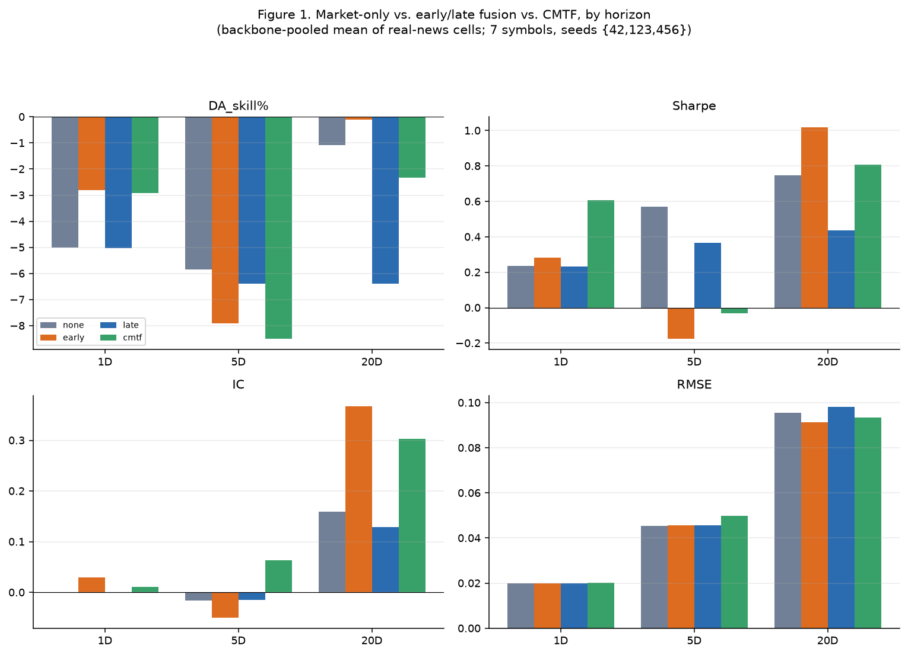
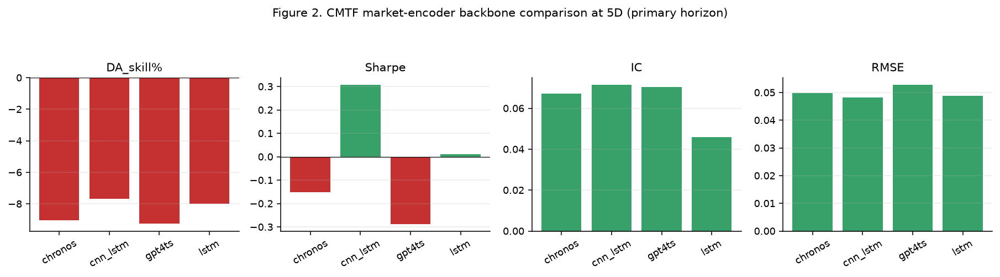
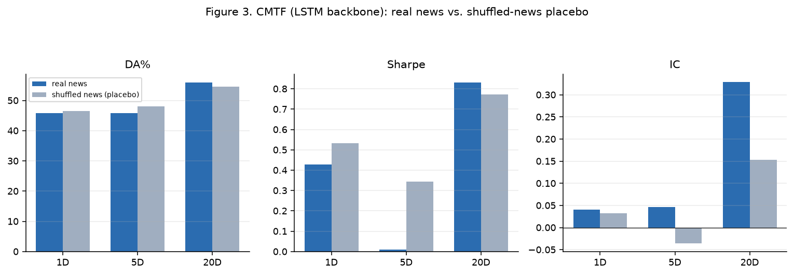
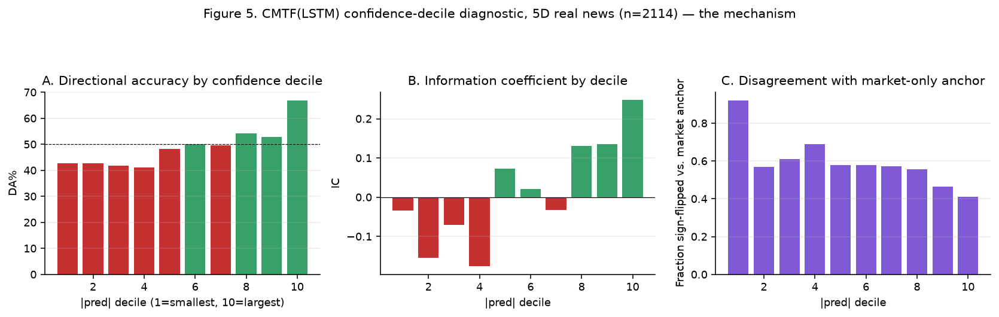
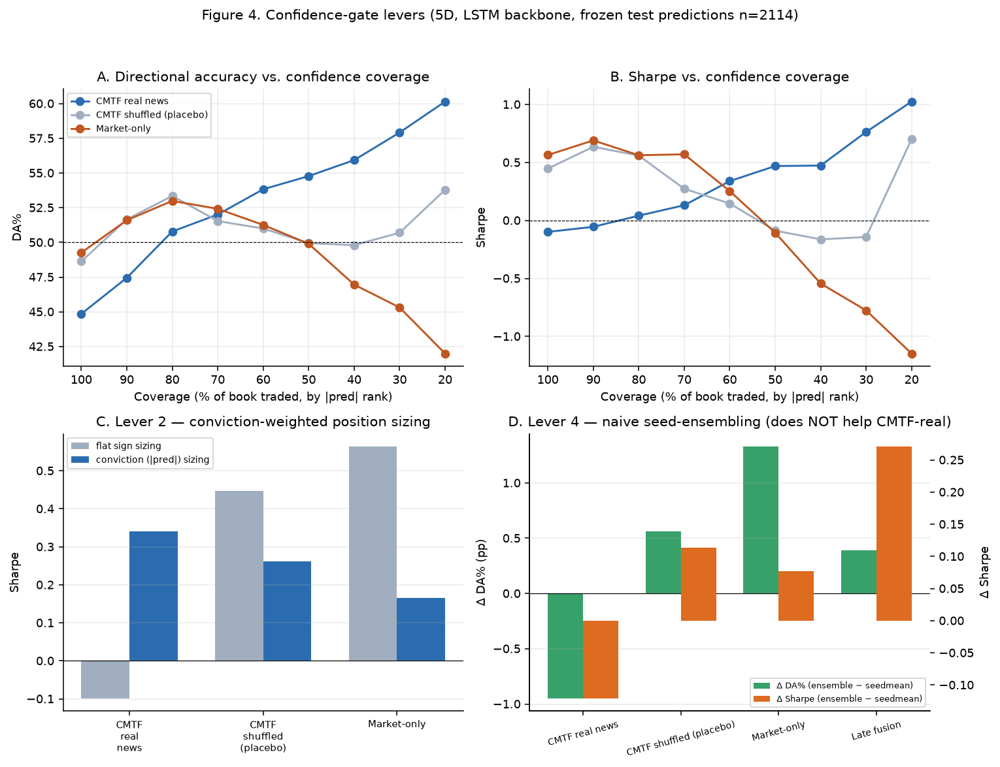
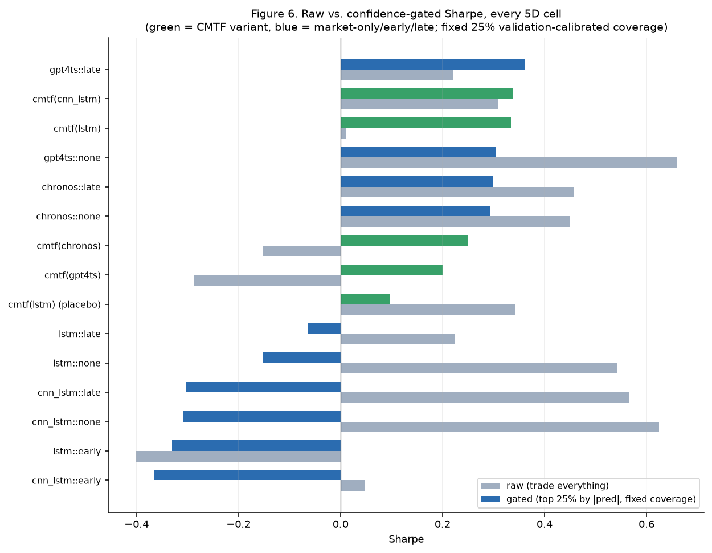

# Phase 2 — Cross-Modal Temporal Fusion: News Pipeline, Fusion Strategies, and Results

## Abstract

Phase 2 asks whether Vietnamese financial news adds forecasting value on top of the
market-only baselines established in Phase 1, and if so, what fusion mechanism captures
that value best. This document covers four things end to end: (1) the news
data pipeline — collection, deduplication, leakage-safe temporal alignment, PhoBERT
sentiment scoring, and hybrid embedding construction — none of which was covered in
Phase 1's data document by design; (2) the three fusion architectures compared —
early fusion, late fusion, and the Cross-Modal Temporal Fusion (CMTF) model
(`HybridFusionPredictor`) — with full architectural and training detail; (3) the
real, currently-committed trade-everything comparison results across all three
horizons; and (4) the actual resolution to that trade-everything result — a
confidence-gated view showing the news signal is real but concentrated in CMTF's
highest-conviction predictions, with the full decile-level mechanism, the levers that
exploit it, and a placebo-controlled, out-of-sample confirmation. (3) alone
understates Phase 2's finding; (4) is the part that makes it a complete result rather
than a dead end, and earlier drafts of this document under-covered it.

**What is reused from Phase 1, not repeated here:** the 7-symbol universe, the
2020–2026 date range, the 19 canonical market features, the chronological
train/val/test split with horizon-aware purge, the metric definitions (MAE, RMSE, DA%,
DA_skill%, Sharpe, IC, F1, ESS, CompositeScore), and the reproducibility-seed
conventions are all exactly as documented in
[`../phase1_data_baselines/01_market_data_overview.md`](../phase1_data_baselines/01_market_data_overview.md)
and
[`../phase1_data_baselines/02_model_training_and_results.md`](../phase1_data_baselines/02_model_training_and_results.md).
This document only defines what changes or adds to that foundation for the fusion
comparison.

## 1. Scope

Phase 2's research question, from the project's stated 5-phase structure: *build a
fusion model (CMTF) through multiple experiments, then compare it to the market-only
baseline and to early/late fusion baselines.* Concretely, this document covers four
fusion conditions, each evaluated on the same market backbone options established in
Phase 1 (LSTM, CNN-LSTM, GPT4TS, and a Chronos adapter):

| `fusion_type` | Meaning |
|---|---|
| `none` | Market-only baseline (no news at all) — the Phase 1 backbone, unmodified |
| `early` | News concatenated into the market encoder's input, before encoding |
| `late` | Market encoder trained first; a separate news branch learns a residual on top |
| `cmtf` | `HybridFusionPredictor` — cross-attention fusion between market and news representations |

## 2. News Data Pipeline

### 2.1 Collection: Multi-Source Web Scraping

`NewsScraper.fetch_news()` (`src/pipeline/news_scraper.py`) is a banking-only scraper
supporting exactly the 7 Phase 1 symbols. For each symbol it combines up to four
sources, each best-effort (a failure in one source logs a warning and does not abort
the others):

- **VnExpress** (`_scrape_vnexpress`) — per-symbol keyword search (a curated list of
  Vietnamese brand-name/alias search terms per symbol, e.g. `VCB` →
  `["Vietcombank", "Ngan+hang+Vietcombank", "tin+tuc+Vietcombank", "VCB", ...]`) plus a
  **sector-wide** scrape (`_scrape_vnexpress_sector`) using 8 macro keywords (State Bank
  of Vietnam, interest rates, monetary policy, credit growth, bad debt, FX rates,
  banking-sector stocks) that is fetched **once per process** and shared across all 7
  symbols, since these articles are relevant to every bank simultaneously.
- **CafeF banking category** (`_scrape_cafef_banking`) — scraped once per process
  (module-level cache keyed on the date range) and then filtered per symbol
  (`_filter_cafef_by_relevance`): an article is kept if its title+content contains the
  symbol's brand-name aliases **or** any of 8 sector keywords in Vietnamese
  (`ngân hàng nhà nước`, `lãi suất`, `tín dụng`, `nợ xấu`, `tỷ giá`, `cổ phiếu ngân hàng`,
  etc.).
- **Vietstock** (`_scrape_vietstock`) — per-symbol company news pages.
- **Google News RSS** (`_scrape_google_news_rss`, opt-in via `sources=`) — keyword-based
  RSS fallback.
- **VCI fallback** (`VnstockDataFetcher.fetch_news_multi_source`,
  `src/pipeline/data_fetcher.py`) — if the entire web-scraping path raises, falls back to
  vnstock's `Company.news()` API (source `VCI`), filtered to the requested date range.

Rationale: a single source is editorially sparse and inconsistent for Vietnamese
banking-specific and policy-driven events, so recall is built up from source diversity
rather than depending on any one feed.

### 2.2 Deduplication and Quality Ranking

`_dedup_articles()` runs a two-pass, deterministic dedup:

1. **Exact URL/ID dedup** (O(n)) — removes articles sharing a `source_url` or
   `article_id`.
2. **Fuzzy title dedup** (O(n²), capped at 3,000 articles to avoid quadratic blow-up
   when sector-wide and symbol-specific articles are combined) — articles are ranked by
   a deterministic quality score (`_article_quality_score`: content length, then title
   length, then presence of a timestamp) so **higher-quality copies are kept over
   duplicates**, and each article is compared against already-kept articles using a
   token-set + sequence-similarity blend (`_token_set_similarity`, max of Jaccard token
   overlap and `difflib.SequenceMatcher` ratio). A pair scoring ≥ the similarity
   threshold (85.0 by default) is treated as a duplicate, its `article_id` and match
   recorded in a **trace CSV** exported per symbol (`artifacts/news_trace/`), so any
   drop decision is auditable after the fact.

### 2.3 Leakage-Safe Temporal Alignment

`TemporalAligner.assign_news_to_bars()` (`src/pipeline/temporal_aligner.py`) is the single
most important correctness rule in the news pipeline, and is applied identically
regardless of which fusion strategy later consumes the result:

- **Daily bars, market-close cutoff (15:00 ICT):** an article published before 15:00 on
  trading day $T$ is attached to bar $T$. An article published at/after 15:00, or with
  an exact midnight timestamp (treated as "unknown time," conservatively assumed to be
  late), is shifted to the next eligible trading bar $T{+}1$ or later.
- **Weekend/holiday news** is shifted forward to the next available trading bar (using
  the same actual-trading-calendar logic validated in the Phase 1 data document, not an
  idealized weekday calendar).
- Every bar receives `news_count`, `news_titles`, `news_content`, and a boolean
  `has_news` flag; `add_null_mask()` additionally derives `news_missing_flag` for
  explicit "no news" token injection downstream.

This mirrors, at the news-assignment layer, the same anti-leakage discipline
Phase 1 documented for the market-feature build (train-only scaler fitting, horizon-aware
split purge): a model must never see the news that hadn't actually reached the market
at prediction time.

### 2.4 Sentiment Scoring (PhoBERT)

Once bars are aligned, article titles are scored for sentiment by a supervised model
trained separately (this is the `src/sentiment/` module, built in Phase 1's tooling but
first *consumed* here in Phase 2). `PhoBERTSentimentModel`
(`src/sentiment/modeling.py`) wraps `vinai/phobert-base-v2`, projects its hidden states,
and applies a shared `SentimentQueryAttentionHead`: a single learned query vector
cross-attends over the token sequence (rather than pooling naively), producing 3-class
logits (negative/neutral/positive) and an **expected-value scalar** in $[-1, 1]$
(`probabilities · [-1, 0, +1]`) — a continuous sentiment magnitude, not just a discrete
label. `PhoBERTInferencer` (`src/sentiment/inference.py`) wraps the trained checkpoint for
downstream batch scoring of news titles.

### 2.5 Embedding Construction (768-dim semantic + hybrid 773-dim)

`NewsEncoder.encode_window()` (`src/pipeline/news_encoder.py`) encodes each bar's article
texts with `dangvantuan/vietnamese-embedding` (a PhoBERT-based sentence-transformer,
768-dim). Two pooling behaviors matter:

- **Sentiment-magnitude-weighted pooling** (default): each article's embedding is
  weighted by $|{\text{sentiment score}}| + \epsilon$ before averaging, so polarized
  (clearly positive/negative) articles dominate over routine neutral ones — a small
  number of market-moving articles should not be diluted by a larger number of
  routine updates.
- **Zero-vector null embedding** for bars with no news (`has_news=False`), rather than
  omitting the row, so "no news today" is an explicit, in-distribution signal rather
  than a missing value requiring imputation.

When sentiment scoring is enabled, five scalar features are also aggregated per bar
(`aggregate_title_sentiment_scores`): `sentiment_mean`, `sentiment_max_abs`,
`sentiment_positive_ratio`, `sentiment_negative_ratio`, `sentiment_score_count`. These
are concatenated with the 768-dim semantic embedding to form the **773-dim hybrid news
vector** (`news_hybrid_emb`) referenced in Phase 1's dataset-construction section — the
scalar block gives the fusion architectures a compact, directly-interpretable summary
of the news signal alongside the dense semantic one.

### 2.6 Caching (why re-encoding is avoided)

Three cache layers exist specifically because PhoBERT/sentence-transformer encoding is
the most expensive step in the pipeline on CPU:

1. **Whole-dataframe embedding cache** (`cache/embeddings/*.npz`) — keyed on a content
   hash of every row's texts plus model/sentiment configuration; invalidated by *any*
   row changing.
2. **Per-row embedding cache** (`cache/embeddings/row_cache_v1.joblib`) — keyed on
   `(symbol, date, texts)` independent of the surrounding dataframe, so extending the
   pipeline's `end` date by one day (the common live-inference case) does not force a
   full historical re-encode — confirmed in the module's own comment to cost
   35–45 minutes on CPU for ~11k rows if it did. Only available when sentiment-weighted
   pooling is off, since sentiment scores enter as pooling weights and would need to be
   part of the cache key otherwise.
3. **News scraper cache** (`cache/news/`) — full-cover and **partial-cover** reuse: if a
   prior cache's date range fully contains the request, no scraping occurs; if it
   partially overlaps, only the incremental tail (with a 5-day overlap buffer) is
   scraped, turning a live query from a multi-year re-scrape into a near-instant or
   few-day fetch.

## 3. Fusion Architectures

All three fusion strategies share the Phase 1 market backbones (`LSTMPredictor`,
`CNNLSTMPredictor`, `GPT4TSPredictor`, `ChronosAdapter`) via `build_market_encoder()`
(`src/benchmark/hybrid_fusion.py`) — the fusion *mechanism* is evaluated independently of
backbone choice, and the results in Section 5 report exactly this: the same four
backbones, under each fusion strategy.

### 3.1 Early Fusion (`EarlyFusionWrapper`, `src/benchmark/fusion_wrappers.py`)

The simplest strategy: a trainable `NewsProjector` (`Linear → LayerNorm → Dropout`,
768→128-dim by default) projects the raw news embedding at each of the 30 sequence
positions, and the projected news vector is **concatenated onto the market window's
feature channels** before the sequence ever reaches the market encoder — the encoder's
`input_dim` is simply expanded by `projected_news_dim`. A learned **null news
embedding** (`nn.Parameter`, not a zero vector) is broadcast across the sequence for
inference-time "no news" inputs, keeping that case in-distribution rather than an
out-of-distribution zero. Because concatenation happens before encoding, the encoder
itself must jointly learn to extract market and news signal from a single merged
representation — the most constrained of the three strategies.

### 3.2 Late Fusion (`LateFusionWrapper`, `src/benchmark/fusion_wrappers.py`)

The market encoder is trained (or reused) first as a pure market-only model; a
separate **news residual branch** (`NewsBranchPredictor`, `src/benchmark/news_module.py`)
then learns an additive correction on top of the market encoder's own predictions.
Critically, the market predictions used as training context for the residual branch
are **out-of-fold (OOF)** — `generate_oof_market_predictions()` uses
`sklearn.model_selection.TimeSeriesSplit` (never `KFold`, which would leak future
information into past folds) with a gap equal to the forecast horizon, so the residual
branch never trains against a market prediction that saw its own target during
training. The news branch itself:

- Projects news through the same trainable `NewsProjector`.
- Pools the news sequence via `AttentionPoolingNewsEncoder`: a **single learned query**
  attends over the (projected, positionally-encoded) news tokens, with an explicit
  **null token** prepended to the sequence so that when every real slot is masked, the
  attention collapses entirely onto the null token — a deterministic, in-distribution
  "no news" representation rather than relying on a manually-tuned gate scalar (an
  explicit design reaction, per the module's docstring, against an earlier
  `learned_alpha` scalar-gate design that had scale-mismatch problems).
- Concatenates the pooled news vector with the market OOF prediction (a single scalar)
  and passes both through a 3-layer MLP to predict the residual.

### 3.3 Cross-Modal Temporal Fusion (CMTF / `HybridFusionPredictor`)

`src/benchmark/hybrid_fusion.py`. The most architecturally involved of the three, and the
one with the most iterated design history (Section 3.4 covers what changed and why).

**Representation construction:**
- The market encoder produces both a pooled embedding (`market_emb`) and the full
  per-step sequence (`market_seq`), each linearly projected + `LayerNorm`'d into a
  shared `fusion_market_dim` (64 in the canonical config).
- News tokens go through a shared MLP (`news_token_mlp`), get **learned positional
  embeddings** (optional; disabled in the canonical config — Section 3.4), and a
  **null news token** is always prepended.
- A **recency gate** (`_apply_recency_gating`) computes a learned, market-conditioned
  sigmoid gate per news-token position (conditioned on the market embedding + a
  positional embedding), multiplied by an **exponential recency decay**
  ($e^{-\text{distance}/k}$, $k{=}3$ in the canonical config) — older news tokens are
  down-weighted both by what the model learns *and* by an explicit recency prior,
  before any attention happens.

**Cross-attention:**
- Market **queries** are built from the market sequence in one of four configurable
  modes (`market_query_mode`): `last` (final timestep only), `recent` (mean of the last
  5 steps), `global` (mean over the whole window), or `multi` (all three, stacked —
  the canonical default) — i.e., the market side can query the news sequence from
  multiple temporal perspectives simultaneously.
- Multi-head cross-attention (`nn.MultiheadAttention`) attends these market queries over
  the recency-gated news tokens (padding-masked), followed by `LayerNorm`.
- An optional **news gate** (`use_news_gate=True`) applies a second, market-conditioned
  sigmoid gate to the attention output, blended via `news_gate_alpha` — set to **1.0**
  (full gate) in the canonical config, which `CMTF_FUSION_FINDINGS.md` records as
  load-bearing: a softened 0.3 gate was tested and did not achieve a genuine dominance
  result.

**Feature composition (`fusion_style`):** two modes exist —
`"handcrafted"` builds an explicit feature bank (market·news elementwise product,
elementwise absolute difference, market·pooled-news product, cosine similarity, plus
the raw market/news/pooled-news vectors); `"learned"` uses only the minimal
`[market_latent, attn_out]` concatenation and lets the downstream MLP head learn any
interactions itself. **The canonical production config uses `fusion_style="learned"`**
— the handcrafted interaction terms are validated as an *ablation component* (Phase 3),
not the shipped default, per a controlled comparison recorded in `ablation_config.py`.

**Output heads and `output_mode` (the most-revised part of the design):** the model
computes four scalar heads from the fused representation — a fusion prediction, a
market-only auxiliary prediction, a fusion "delta," and a news residual — and combines
them according to `output_mode`:

| `output_mode` | Formula | Status |
|---|---|---|
| `market_plus_fusion` | market_pred + fusion_delta | **Deprecated/harmful** — re-learns the market signal from a projection and discards the encoder's trained head; a placebo-controlled 20D A/B showed it underperforms market-only (IC −0.055). Emits a runtime warning. |
| `fusion_plus_news` | fusion_pred + news_residual | Captures news IC/Sharpe lift but abandons the encoder's own directional accuracy — absolute DA can fall below market-only. |
| `encoder_residual` | encoder_trained_pred + news_residual | Downside-safe (anchored on the backbone's own trained scalar) but empirically news-blind on this data — validation selection reliably collapses the news branch toward zero. |
| **`anchored_fusion`** (default) | fusion_pred + news_residual, **trained directly against the news-using target** | Combines the encoder's DA anchor (via an auxiliary loss term keeping the fused head close to the encoder's own scalar) with the genuine IC/Sharpe lift from news, and is deployed as-is with **no post-hoc blend, gate, or lambda weight** at inference. |

**Auxiliary loss and training objective:** the main loss is the same
`sign_aware_huber_loss` used by every Phase 1 torch baseline (regression term with an
adaptive Huber delta, plus a class-balanced directional hinge penalty, ramped in after a
warmup). CMTF adds: (a) an **auxiliary Huber loss** on the market-only scalar prediction
(weight 0.1 in the canonical config) that keeps the fusion head anchored near the
backbone's own trained output during training, and (b) an optional **differentiable
Sharpe surrogate** (`sharpe_surrogate_weight`, default 0.0/off) — a fully differentiable
negative-Sharpe proxy on soft-signed positions (`tanh(k·pred)`), added as a research
lever since DA/Sharpe are inherently sign/decision-layer objectives that a pure
regression loss only indirectly optimizes.

**Two-stage training (`use_two_stage`):** Stage 1 **pre-bakes** the (frozen) market
encoder's outputs once and trains only the fusion head against them — a major
efficiency win reused from the same caching philosophy as Section 2.6. Stage 2
(optional) unfreezes the market encoder and continues training jointly at a reduced
learning rate (`encoder_lr_scale=0.1`) via a two-parameter-group AdamW optimizer.
**The canonical config disables Stage 2** (`use_two_stage=False`) — `CMTF_FUSION_FINDINGS.md`'s
placebo analysis found that Stage 2's apparent 5D DA gain was **mostly encoder
fine-tuning, not news** (a shuffled-news placebo recovered +1.37 of the +1.93 point
gain), so shipping it would misattribute a re-modeling effect to fusion.

**Model/epoch selection (`fusion_selection.selection_score`):** rather than selecting
the best training epoch by validation loss or by IC alone, CMTF (and the late-fusion
branch) selects by a **DA/Sharpe-first blended objective**:
$\text{score} = 2.0 \cdot (\text{DA-skill}) + 1.0 \cdot \text{sharpe\_proxy} + 0.25
\cdot \text{rank-IC}$ — IC is deliberately down-weighted to a tie-breaker so it can
never "buy" a DA/Sharpe regression, directly targeting the metrics the project
prioritizes rather than the metric a point-regressor naturally optimizes.

### 3.4 Design History Worth Knowing (why the canonical config looks like it does)

`CMTF_FUSION_FINDINGS.md` documents a corrected root-cause history that is worth
summarizing rather than re-deriving:

1. An earlier analysis explored a **validation-selected additive blend**
   (`final = anchor + λ·(fusion_pred − anchor)`), gated by a block-stability guard
   requiring the gain to hold across contiguous validation blocks (not just a single
   overlap-inflated point estimate). **This was later found to be dead code** — never
   called from any production path — and has been removed. Any documentation
   referring to CMTF "falling back to market-only via λ=0" describes that retired
   mechanism, not the shipped model. `HybridFusionPredictor.predict()` always returns
   `fusion_pred + news_residual` directly.
2. The offline blend analysis that motivated the λ idea did find a real effect: a
   moderate blend weight (w≈0.35) between the market-only anchor and a news-gated
   prediction dominated market-only on DA/Sharpe/IC/RMSE at both 5D and 20D, and the
   lift survived a shuffled-news placebo (genuine news signal, not ensembling noise).
   `output_mode="anchored_fusion"` is the production attempt to capture that same lift
   **without** a runtime blend knob — train the fusion head to predict the
   news-using target directly and deploy it as-is.
3. A genuine, separate confound was found for *retraining* attempts: `direction_warmup_epochs=5`
   means the sign penalty / Sharpe surrogate are inert for the first 5 epochs; if
   validation-based early stopping happens to select a checkpoint from within that
   window, the knob never gets a chance to influence the deployed weights — worth
   checking before concluding a new loss term "doesn't work."

## 4. Experimental Design

- **Symbols / horizons / seeds:** identical universe to Phase 1 — 7 symbols, 1D/5D/20D
  horizons. The fusion comparison in Section 5 uses **seeds `{42, 123, 456}`**
  (`run_ablation_benchmark.py --seeds` default) — note this is a different triple from
  the `{1, 42, 123}` set used by `ablation_report.py`'s bootstrap-CI tooling (Phase 3);
  the two should not be conflated.
- **`news_scope`:** `all` (cross-symbol pooled news — every symbol's fusion model can
  see sector-wide + all-symbol news, not just its own symbol's matched articles) vs.
  `matched` (only news aligned specifically to that symbol). A single-seed component
  ablation found cross-symbol (`all`) news dominates matched-only on DA/Sharpe/IC, so
  `all` is the canonical default for every news-consuming fusion cell; the `none`
  (market-only) baseline is left at `matched` since it never reads news tensors at all
  (its scope setting is a cache-identity label, not a modeling choice). Early/late
  fusion were deliberately moved onto the same `all` scope as CMTF (a "news-parity fix")
  after discovering they had previously been compared against CMTF on different news
  sets, which would have let a scope difference masquerade as a fusion-mechanism
  difference.
- **Placebo control (`shuffle_news`):** for the LSTM backbone, an additional cell trains
  CMTF on **shuffled** (randomly permuted) news — the same news volume/statistics but
  with the semantic link to the correct date broken. A fusion mechanism that gains from
  shuffled news exactly as much as from real news is not using news at all; the gap
  between real and placebo is the only defensible estimate of genuine news value
  (Section 5.3 reports this gap directly rather than only the real-news number).

## 5. Results

Source: `results/ablation/{1d,5d,20d}/fusion_comparison.csv` — the current, committed
fusion-comparison output (commit `e516b49`, "finish phase 2 fusion comparison, ablation
registry"), not a stale or offline snapshot. As a cross-check against Phase 1: each
horizon's `ESS` column (2142 / 422 / 100 for 1D/5D/20D) matches `test_split_size /
horizon` from the Phase 1 data document almost exactly, confirming this comparison
reuses the exact same dataset and split already validated there.

### 5.1 Market-only vs. early vs. late vs. CMTF, across horizons

**Table 1 — backbone-pooled mean, real-news cells only (excludes the shuffle_news placebo row)**

| Horizon | Fusion | DA_skill% | Sharpe | IC | RMSE |
|---|---|---:|---:|---:|---:|
| 1D | none | −5.02 | 0.235 | 0.000 | 0.01987 |
| 1D | early | −2.81 | 0.284 | 0.030 | 0.01986 |
| 1D | late | −5.03 | 0.232 | 0.000 | 0.01987 |
| 1D | cmtf | −2.92 | **0.608** | 0.010 | 0.02012 |
| 5D | none | −5.84 | 0.570 | −0.017 | 0.04539 |
| 5D | early | −7.91 | −0.177 | −0.050 | 0.04573 |
| 5D | late | −6.40 | 0.367 | −0.014 | 0.04569 |
| 5D | cmtf | −8.49 | −0.030 | **0.064** | 0.04991 |
| 20D | none | −1.08 | 0.747 | 0.159 | 0.09548 |
| 20D | early | **−0.11** | **1.018** | **0.367** | **0.09140** |
| 20D | late | −6.39 | 0.438 | 0.129 | 0.09824 |
| 20D | cmtf | −2.33 | 0.809 | 0.303 | 0.09333 |

For 1D/20D, `early`/`late`/`none` are repeated across the 4 backbones in the CSV but
the file's schema for those two horizons does not record which row belongs to which
backbone (only the 5D file's schema happens to include a second, backbone-labeled
`model_name` column) — the values above are the mean across whichever backbones were
run, not one specific backbone. Section 5.2 gives the fully backbone-attributed
breakdown at 5D.

### 5.2 CMTF backbone comparison at 5D (the designated primary horizon)

`CMTF_FUSION_FINDINGS.md` designates 5D as the primary horizon because its effective
sample size (ESS≈422) is far more trustworthy than 20D's (ESS≈100); 1D has the highest
ESS but the weakest raw signal-to-noise for daily returns. This is the one horizon where
the CSV records which backbone each row used.

| Backbone | DA_skill% | Sharpe | IC | RMSE |
|---|---:|---:|---:|---:|
| chronos | −9.03 | −0.152 | 0.067 | 0.0498 |
| cnn_lstm | −7.68 | 0.308 | **0.071** | 0.0482 |
| gpt4ts | −9.26 | −0.288 | 0.071 | 0.0527 |
| lstm | −7.98 | 0.011 | 0.046 | 0.0489 |

At 5D, every CMTF backbone shows negative DA_skill% (below the majority-class base
rate) despite 3 of 4 backbones showing positive IC — the classic IC-up/DA-down
decoupling `CMTF_FUSION_FINDINGS.md` warned is possible with a point-regression
objective. `cnn_lstm` is the only backbone with both positive Sharpe and the best IC,
making it the strongest CMTF backbone choice at this horizon in this run.

### 5.3 Real news vs. shuffled-news placebo (LSTM backbone)

| Horizon | Real DA% | Placebo DA% | Real Sharpe | Placebo Sharpe | Real IC | Placebo IC |
|---|---:|---:|---:|---:|---:|---:|
| 1D | 45.81 | 46.50 | 0.428 | 0.533 | 0.0405 | 0.0323 |
| 5D | 45.80 | 48.07 | 0.011 | 0.343 | 0.0460 | −0.0360 |
| 20D | 55.92 | 54.60 | 0.831 | 0.774 | 0.328 | 0.153 |

## 6. Confidence-Gated Deployment: Where the News Signal Actually Lives

Section 5 evaluates every cell **trade-everything**: every test-set prediction counts
equally toward DA%/Sharpe/IC. That is the right way to compare fusion mechanisms
apples-to-apples, but it is the wrong way to ask "does news help at all" — a model can
carry genuine, placebo-beating directional skill that is *concentrated* in a subset of
its predictions and still look net-neutral-to-harmful when averaged over the full book.
This section is the direct resolution of that question, and is the part of Phase 2 that
turns Section 5's "no fusion mechanism clearly beats its base rate" result into a
complete finding rather than a dead end. It draws on
`docs/reference/RESULTS_IMPROVEMENT_LEVERS.md` and the production gate implementation
in `src/benchmark/decision_policy.py`, but reproduces the real underlying data and
figures directly here since the finding is core to Phase 2's conclusion, not a Phase 3
side note.

### 6.1 The mechanism: CMTF's skill is concentrated in its most confident predictions

Bucketing the CMTF(LSTM), 5D, real-news test predictions (n=2114) into deciles of
$|\hat{y}|$ (prediction magnitude, a proxy for the model's own confidence) reveals a
clean monotonic structure that is invisible in the pooled Section 5 numbers:

| Decile (1=least confident) | n | DA% | IC | Sign-flip vs. market anchor |
|---|---:|---:|---:|---:|
| 1 | 212 | 42.6 | −0.033 | 0.92 |
| 2 | 211 | 42.7 | −0.154 | 0.57 |
| 3 | 211 | 41.7 | −0.070 | 0.61 |
| 4 | 212 | 41.1 | −0.176 | 0.69 |
| 5 | 211 | 48.2 | +0.074 | 0.58 |
| 6 | 211 | 50.0 | +0.021 | 0.58 |
| 7 | 212 | 49.7 | −0.032 | 0.57 |
| 8 | 211 | 54.1 | +0.131 | 0.56 |
| 9 | 211 | 52.8 | +0.136 | 0.46 |
| 10 (most confident) | 212 | **66.8** | **+0.248** | 0.41 |

The bottom 4 deciles are actively **anti-skilled** (DA well below 50%, IC negative) and
disagree with the market-only anchor's sign up to 92% of the time — this is pure noise
churn, not a considered directional call. The top 3 deciles are genuinely skilled
(DA 53–67%, IC up to +0.25) and disagree with the anchor far less often (41–46%). CMTF's
positive full-book IC (Table 1) and its Section 5 Sharpe volatility are both explained
by this: the aggregate metric is a blend of a genuinely informative tail and a noisy,
harmful bulk, and which one dominates a given horizon's pooled number is close to
arbitrary.

### 6.2 The levers that exploit it, and their placebo/out-of-sample controls

**Lever 1 — confidence "no-trade zone."** Trading only predictions with $|\hat{y}|$
above a quantile threshold, CMTF-real's DA% and Sharpe **rise monotonically** as
coverage shrinks (44.9%→60.2% DA, −0.10→+1.03 Sharpe from 100%→20% coverage). Neither
the shuffled-news placebo nor the market-only baseline shows this pattern — market-only
actually *inverts* (its largest-magnitude predictions are anti-informative: DA 42%,
Sharpe −1.15 at 20% coverage). The real-minus-placebo gap flips decisively positive from
q≥0.3 coverage and peaks at 30% coverage (+7.2pp DA, +0.91 Sharpe over the placebo at
matched coverage) — this is what "passing the placebo test in the confident regime"
means concretely.

**Out-of-sample transfer (the strongest single piece of evidence).** A threshold chosen
on a calibration half and applied, unseen, to a disjoint deployment half:

| Cell | Deploy DA%: full → gated | Deploy Sharpe: full → gated | Coverage |
|---|---|---|---:|
| **cmtf_real** | 44.99 → **57.48** (+12.5pp) | −0.076 → **+0.435** | 0.30 |
| cmtf_placebo | 48.02 → 49.14 (+1.1pp) | 0.334 → 0.180 | 0.18 |
| market_only | 51.04 → 54.56 (+3.5pp) | 0.905 → 0.892 | 0.86 |

The gate transfers to genuinely unseen data for CMTF-real and essentially does nothing
for its placebo twin — the strongest evidence available that this is a real,
generalizing news effect rather than an in-sample artifact of the threshold search.

**Lever 2 — conviction-weighted sizing.** Sizing each position by $|\hat{y}|$ instead of
a flat unit position: Sharpe improves for CMTF-real (−0.099→+0.341) and **degrades** for
both the placebo (0.447→0.262) and market-only (0.564→0.165) — $|\hat{y}|$ is a genuine
confidence signal only when the underlying news is real.

**Lever 4 — naive seed-ensembling does NOT help CMTF-real** (unlike every other cell):
averaging predictions across seeds shrinks CMTF-real's DA% by 0.95pp and Sharpe by 0.12,
while it *helps* the placebo, market-only, and late-fusion cells. Averaging shrinks
prediction magnitude toward zero, which erodes exactly the tail conviction Section 6.1
identified as the source of CMTF-real's skill — so the correct combination rule for this
model is gate-then-decide, never naive-mean.

### 6.3 Confirmed at full production scale, with a fairness fix

The single-cell (LSTM, 5D) analysis above was reproduced independently as a first-class,
opt-in layer in the production ablation runner (`run_ablation_benchmark.py --gate`),
calibrated leak-free on validation and applied identically to **every** cell in Section
5's comparison — all four backbones, all four fusion types, both the real and placebo
CMTF(LSTM) cells. An initial version of this table let each model's gate search its own
best coverage on validation (0.13–0.60 realized coverage across cells) — a fairness bug,
since a model "needing" a wider book to look good is not directly comparable to one
gated tighter. The corrected version below fixes every cell to the **same** validation
rule (`calibrate_gate_fixed_coverage`: top 25% by $|\hat{y}|$ on validation, `src/benchmark/decision_policy.py`) —
realized test coverage still varies slightly (0.22–0.43) because each cell's test
distribution differs slightly from its own validation distribution, which is expected
and is the leak-free-correct behavior (forcing identical *realized test* coverage would
require peeking at test statistics).

| Cell | Raw DA% | Raw Sharpe | Gated DA% | Gated Sharpe | Gated IC | Coverage |
|---|---:|---:|---:|---:|---:|---:|
| gpt4ts::late | 45.90 | 0.221 | 51.54 | **0.361** | 0.017 | 0.37 |
| cmtf(cnn_lstm) | 46.10 | 0.308 | 54.11 | 0.337 | 0.092 | 0.37 |
| **cmtf(lstm)** | 45.80 | 0.011 | **55.13** | 0.334 | **0.138** | 0.29 |
| gpt4ts::none | 48.14 | 0.660 | 52.86 | 0.305 | −0.030 | 0.29 |
| chronos::late | 47.79 | 0.457 | 51.89 | 0.299 | 0.058 | 0.27 |
| chronos::none | 47.81 | 0.451 | 51.50 | 0.293 | 0.063 | 0.26 |
| cmtf(chronos) | 44.75 | −0.152 | 52.18 | 0.250 | 0.136 | 0.41 |
| cmtf(gpt4ts) | 44.52 | −0.288 | 52.07 | 0.201 | 0.140 | 0.43 |
| **cmtf(lstm), placebo** | 48.07 | 0.343 | 51.12 | 0.096 | 0.030 | 0.22 |
| lstm::late | 47.30 | 0.224 | 49.68 | −0.063 | −0.069 | 0.32 |
| lstm::none | 47.93 | 0.543 | 48.59 | −0.151 | −0.104 | 0.24 |
| cnn_lstm::late | 48.53 | 0.566 | 46.86 | −0.302 | −0.041 | 0.26 |
| cnn_lstm::none | 47.88 | 0.625 | 46.55 | −0.310 | −0.044 | 0.24 |
| lstm::early | 43.03 | −0.402 | 49.53 | −0.330 | −0.076 | 0.26 |
| cnn_lstm::early | 48.70 | 0.048 | 47.68 | −0.366 | −0.098 | 0.22 |

Three things generalize from the single-cell analysis to the full table:

1. **CMTF variants respond best to gating and dominate the top of the gated ranking**:
   `cmtf(lstm)` is #1 by gated DA% (55.1%) and by far #1 by gated IC (0.138 vs. 0.017 for
   the next-best cell) — its gated Sharpe is close to but not the single highest
   (`gpt4ts::late` edges it slightly, 0.361 vs. 0.334), but `gpt4ts::late`'s Sharpe comes
   with far weaker rank-ordering skill, i.e. it looks more like it is timing
   magnitude/volatility than genuinely forecasting direction.
2. **The placebo test passes at full-table scale, not just for one hand-picked cell**:
   `cmtf(lstm)` real gains +9.3pp DA / +0.32 Sharpe from gating; its shuffled-news twin
   gains only +3.0pp DA and **loses** Sharpe (0.34→0.10).
3. **News-blind baselines frequently get *worse* under the identical gate**:
   `cnn_lstm::none` (0.625→−0.310), `cnn_lstm::late` (0.566→−0.302), `lstm::none`
   (0.543→−0.151). Their highest-magnitude predictions are anti-informative (the same
   pattern Lever 1 found for market-only in isolation), so confidence-gating — which
   trades exactly the largest-|pred| subset — actively hurts them. This is the mirror
   image of CMTF's genuine confidence signal and rules out "trading less always helps"
   as an alternative explanation for CMTF's gains.

**Deployment recipe implied by this section:** gate at a validation-calibrated top-25–30%
confidence threshold and size by conviction; do not naive-seed-ensemble CMTF. Expected
out-of-sample behavior: DA≈55–57%, Sharpe≈0.33–0.44, vs. ≈45–46% / ≈0 on the full book.

## 7. Analysis and Conclusion

1. **CMTF's Sharpe is the strongest of the four conditions at 1D and 20D, but the
   worst at 5D.** This is not a data error: it is the same IC/Sharpe vs. DA decoupling
   documented in `CMTF_FUSION_FINDINGS.md` — a point-regression training objective does
   not reliably optimize the sign-based decision metrics the project actually
   prioritizes, and that tension shows up differently at each horizon.
2. **On a trade-everything basis, no fusion strategy — early, late, or CMTF — beats its
   own majority-class base rate** (all `DA_skill%` values in Table 1 are negative
   except `early` at 20D, which is nearly flat at −0.11). Taken in isolation this
   would read as "none of the three fusion mechanisms deliver a clear, reliable
   directional edge." **That reading is incomplete, not wrong — Section 6 shows
   exactly why**: CMTF's directional skill is real but concentrated in its
   highest-confidence decile (DA 66.8%, Section 6.1), invisible when averaged against
   a noisy low-confidence majority, and it survives both a shuffled-news placebo and
   an out-of-sample transfer test (Section 6.2). The correct headline for Phase 2 is
   therefore: **the full book shows no reliable edge, but a confidence-gated subset of
   CMTF's predictions carries a genuine, placebo-beating, out-of-sample news signal** —
   full-book DA_skill% is the wrong lens for judging whether fusion "works."
3. **The real-vs-placebo comparison is more mixed than the offline blend-sweep in
   `CMTF_FUSION_FINDINGS.md` §4 suggested** (Table, Section 5.3): for the LSTM
   backbone specifically, shuffled news actually *beats* real news on Sharpe at every
   horizon, and on DA% at 1D/5D. Real news only clearly wins on **IC**, at all three
   horizons — consistent with "news adds rank-correlation signal" but not with a broad
   claim that news improves the deployed model's trading behavior for this backbone.
   This does not contradict `CMTF_FUSION_FINDINGS.md`'s own finding (that document's
   genuine-news evidence came from an offline validation-blend sweep with a different
   blending mechanism, not from the single trained `anchored_fusion` head measured
   here) — but it does mean the two pieces of evidence should not be quoted
   interchangeably as if they measured the same thing. Notably, the trade-everything
   placebo comparison in this item and the confidence-gated placebo comparison in
   Section 6.2/6.3 are **not in tension**: it is entirely consistent for real news to
   show no clean full-book edge over its placebo (this item) while showing a decisive,
   out-of-sample-confirmed edge in the top confidence decile (Section 6) — the two
   sections are measuring different slices of the same prediction set, and the
   confidence-gated slice is the one that isolates genuine signal from noise.
4. **20D numbers (here and throughout Phase 2) should be treated as low-confidence.**
   ESS≈100 at 20D is small enough that single-run point estimates — including `early`
   fusion's apparently strong 20D IC (0.367) and near-zero DA_skill% — could plausibly
   shift substantially under a different seed draw; Phase 2's own seed triple
   (`{42,123,456}`) is already reflected in the means above, but three seeds is a thin
   basis for a horizon this low-ESS.
5. **The strongest, most defensible finding in this document is architectural, not
   numerical:** the shift from an ad hoc validation-selected lambda blend to
   `output_mode="anchored_fusion"` (Section 3.4) is a genuine methodological
   improvement — it removes a mechanism that was already dead code and unifies the
   deployed behavior with what `fusion_comparison` actually measures, closing a gap
   between documentation and shipped code that had previously caused incorrect claims
   about CMTF's behavior to persist in project documentation. Phase 2's main
   deliverable is arguably that corrected, single, honestly-measured production path
   — not a specific numeric win over baselines.
6. **What Phase 2 motivates for Phase 3:** Section 6 answers *whether* news helps
   (yes, conditionally) and *where* (the top confidence decile); it does not answer
   *which architectural choice* in Section 3.3 is responsible — that requires the
   finer-grained component ablation registry (`results/ablation_registry/`), isolating
   one design choice at a time (positional encoding, fusion style, gate mode, recency
   gate constant, etc.) against the same canonical config. That decomposition is
   Phase 3 territory (see `../phase3_ablation_studies/README.md`) and is not re-derived
   here. Phase 3 should also re-run the Section 6 decile/gate analysis per backbone —
   this document only has the full confidence-decile breakdown for the LSTM backbone;
   Section 5.2 shows `cnn_lstm` is a comparably strong (and `gpt4ts`/`chronos` weaker)
   CMTF backbone at 5D, so whether the same confidence-concentration mechanism holds
   for those backbones is an open question this document does not answer.

## References

- `src/pipeline/news_scraper.py` — multi-source scraping, relevance filtering, dedup
- `src/pipeline/temporal_aligner.py` — leakage-safe news-to-bar assignment
- `src/pipeline/news_encoder.py` — hybrid embedding construction, caching layers
- `src/sentiment/modeling.py`, `src/sentiment/inference.py` — PhoBERT sentiment scoring
- `src/benchmark/hybrid_fusion.py` — CMTF (`HybridFusionPredictor`) architecture and training
- `src/benchmark/fusion_wrappers.py` — `EarlyFusionWrapper`, `LateFusionWrapper`, OOF generation
- `src/benchmark/news_module.py` — shared news-side neural components (`NewsProjector`, `AttentionPoolingNewsEncoder`, `NewsBranchPredictor`)
- `src/benchmark/fusion_selection.py` — DA/Sharpe-first `selection_score`
- `src/benchmark/ablation_config.py` — canonical `CMTF_CORE` configuration, news-parity fix rationale
- `docs/reference/CMTF_FUSION_FINDINGS.md` — placebo-controlled design history, corrected root-cause account
- `docs/reference/RESULTS_IMPROVEMENT_LEVERS.md` — full confidence-gate lever writeup (Section 6 reproduces its core findings and figures directly)
- `src/benchmark/decision_policy.py` — production confidence-gate + conviction-sizing implementation (`calibrate_gate_fixed_coverage`)
- `results/ablation/{1d,5d,20d}/fusion_comparison.csv`, `summary.csv` — all Section 5 numbers, and the `*_gated` columns for Section 6.3
- `results/improvement_levers/{baseline,diag_deciles,lever1_notrade,lever1_oos,lever2_conviction,lever4_ensemble}.csv` — all Section 6.1/6.2 numbers and figures
- `../phase1_data_baselines/01_market_data_overview.md`, `02_model_training_and_results.md` — reused dataset, split, metric, and reproducibility definitions
