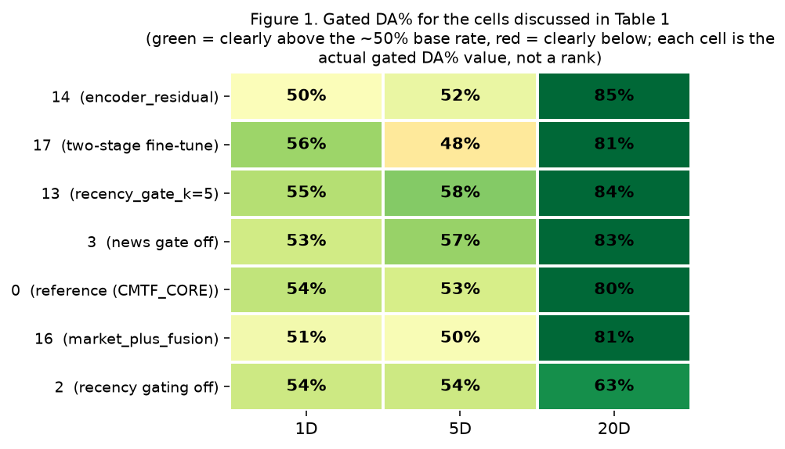
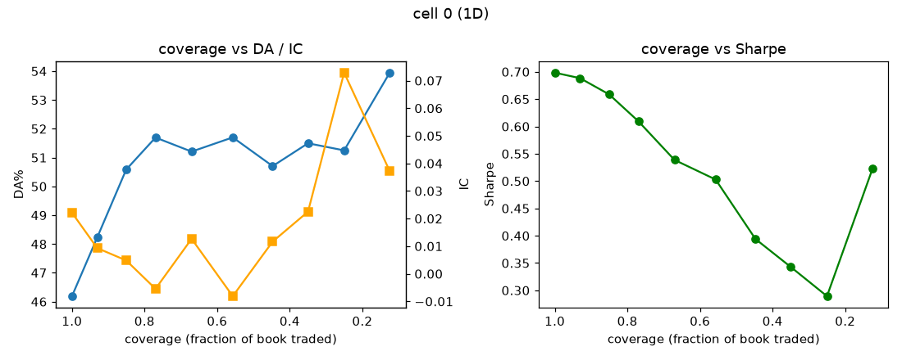
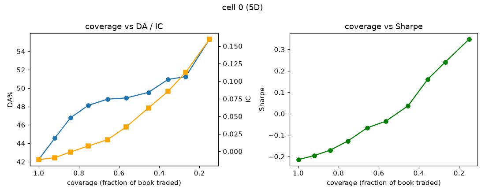
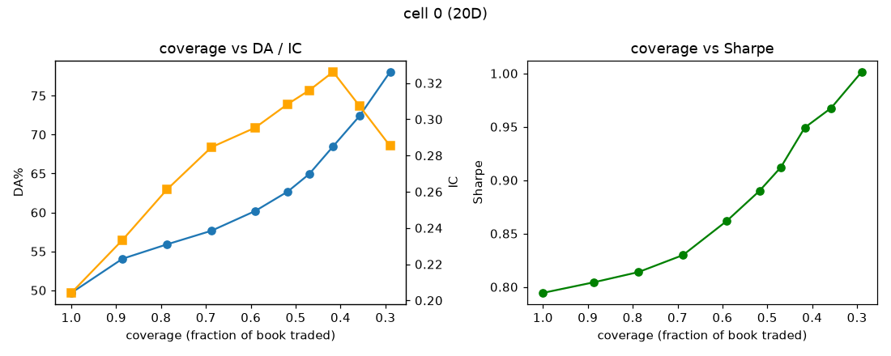
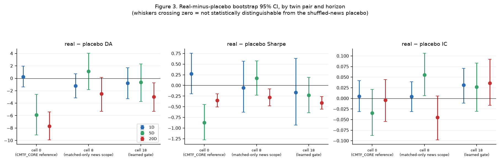
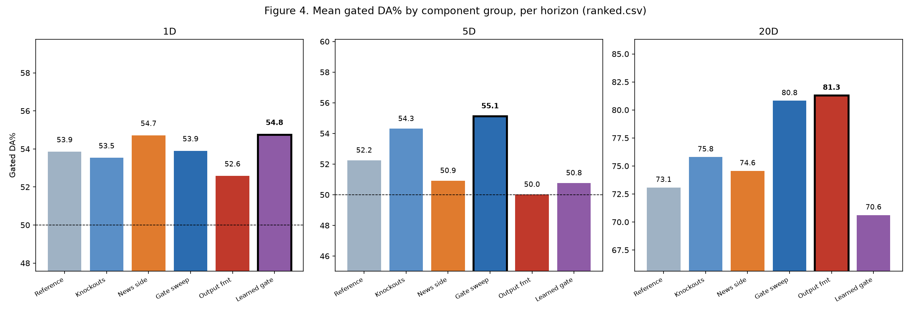

# Phase 3 — Component Ablation Registry: Isolating What Makes CMTF Work

## Abstract

Phase 2 established that CMTF's news signal is real but concentrated in its
highest-confidence predictions, using one fixed architecture (`CMTF_CORE`, the deployed
LSTM configuration). Phase 3 asks a narrower, more mechanistic question: **which specific design
choice inside that architecture is responsible for the result** — the cross-attention,
the recency gate, the news gate, the auxiliary anchor loss, the output-formulation
choice, or something else? This document covers the ablation registry that answers
that question: its config-driven, single-source-of-truth design (22 cells, each a
one-field override from `CMTF_CORE`), the multi-level caching that makes running it
tractable, and the real, currently-committed results across all three horizons — which
turn out to disagree with each other far more than a tidy ablation study would predict,
and that disagreement is itself the headline finding of this document.

**What is reused from Phase 1/2, not repeated here:** the dataset, split, symbols,
horizons, and metric definitions (Phase 1); the CMTF architecture itself, the
`anchored_fusion` output-mode design history, and the confidence-gate mechanism
(Phase 2 §3 and §6) — this document assumes that background and only explains what
Phase 3 adds: a systematic, per-component decomposition of *why* CMTF behaves the way
Phase 2 measured.

## 1. Scope

Phase 2 compared fusion *mechanisms* (none/early/late/CMTF) holding each mechanism's
internal design fixed. Phase 3 holds the mechanism fixed (CMTF, LSTM backbone,
`anchored_fusion`) and varies exactly one architectural or configuration choice at a
time, so that every metric delta between a cell and the reference is attributable to
that one choice — not to a different backbone, a different news scope, or a different
random initialization scheme. The registry only studies the LSTM backbone — the
configuration actually deployed (`cache/deploy_models/cmtf_lstm_{1,5,20}d_seed*.pt`) and
the one Phase 2's confidence-gate analysis (§5.3 onward) was built around — by explicit
design choice recorded in `src/benchmark/ablation_registry.py`. Note this is a disclosed,
not re-litigated, tension with Phase 2 §5.2's own backbone comparison, which actually
found `cnn_lstm` (not LSTM) had the best IC and only-positive Sharpe among the four
backbones tested; Phase 3 does not re-derive that comparison, it only studies components
within the LSTM configuration that is actually in production.

## 2. Ablation Registry Design

### 2.1 One-field-override cells (`src/benchmark/ablation_registry.py`)

Every cell is declared as `CMTF_CORE` (Phase 2 §3.3's canonical configuration) plus a
single named override — there are no hand-written per-cell training scripts, so a new
ablation is a one-line dictionary addition, not a new code path. Cells are organized
into six groups:

| Group | Cells | What varies |
|---|---|---|
| 0 — Reference | `0`, `0p` | The unmodified `CMTF_CORE` anchor, plus its shuffled-news placebo twin |
| 1 — Component knockouts | `1`–`7` | One architectural component disabled/flipped: cross-attention, recency gating, news gate, auxiliary anchor loss, variance regularization, sentiment features, positional encoding |
| 2 — News side | `8`, `8p`, `9` | News scope (`matched` vs. `all`) and handcrafted vs. learned feature composition (Phase 2 §3.3) |
| 3 — Gate sweep | `10`–`13` | `news_gate_alpha` ∈ {0.3, 0.5} and `recency_gate_k` ∈ {1, 5}, with `CMTF_CORE`'s own values (1.0, 3) as the implicit sweep center via cell `0` |
| 4 — Output formulation | `14`–`17` | Reconfirms all four `output_mode` variants and `use_two_stage`, from Phase 2 §3.3/§3.4 |
| 5 — Learned gate | `18`, `18p` | Replaces the fixed `news_gate_alpha` scalar with a per-sample trainable mixing head, plus its placebo twin |

`PLACEBO_PAIRS` designates three real/placebo twins for statistical comparison: `0`/`0p`
(the reference), `8`/`8p` (matched-only news scope), and `18`/`18p` (learned gate) —
not every cell has a placebo twin; these three were selected as the cells where a
genuine-vs-artifact distinction was judged most important to verify directly rather than
inferred.

### 2.2 Execution engine and caching (`src/benchmark/ablation_runner.py`)

Running 22 cells naively would mean training 22 independent CMTF models per horizon per
seed. The runner avoids this with three cache layers, each keyed only on the parameters
that actually affect its contents:

- **Encoder cache** — the LSTM market encoder is trained **once** per
  `(backbone, horizon, seed)` and reused across every cell that doesn't change a
  market-encoder-affecting parameter. Since most Group 1/2/3/5 cells only change the
  *fusion* side (news gate, recency constant, gate mode) and never the market encoder
  itself, the overwhelming majority of cells reuse an identical cached encoder rather
  than retraining one — this is also what makes every non-encoder cell's metric delta
  cleanly attributable to its one changed field, since the market representation feeding
  every cell is byte-identical.
- **Anchor cache** — the frozen market-only prediction (used for `ModalDisagreement`
  and as the `encoder_residual` output-mode's base) is cached the same way.
- **OOF cache** — out-of-fold predictions (needed for cells resembling Phase 2's late
  fusion) are cached with a key that additionally captures the cross-validation
  configuration.

This mirrors the same caching philosophy documented in Phase 2 §2.6 (news embedding
caching) and `docs/reference/CACHING_GUIDE.md` — expensive, reusable computation is
cached at the narrowest scope that remains numerically valid, not recomputed per cell.

### 2.3 Gated metrics as the primary reported metric

Following directly from Phase 2 §6, every cell's confidence gate is calibrated with the
same fixed-coverage rule (`calibrate_gate_fixed_coverage`, top ~25% by $|\hat{y}|$ on
validation) and applied to that cell's own frozen test predictions. The registry reports
gated DA%/Sharpe/IC as **primary**, with raw (trade-everything) metrics alongside for
reference — a direct methodological consequence of Phase 2's finding that the
trade-everything view hides the news signal.

### 2.4 Statistical tooling (`src/benchmark/ablation_report.py`)

- **Real-minus-placebo bootstrap CI** — for each of the three placebo-paired cells,
  paired bootstrap resampling (2,000 resamples) of test-set indices gives a 95% CI on
  (real − placebo) for DA%, Sharpe, and IC computed on **raw** (not gated) predictions.
  A CI that excludes zero is evidence the real/placebo difference is unlikely to be
  sampling noise; a CI that crosses zero means the point estimate cannot be
  distinguished from noise at this sample size.
- **Gate monotonicity (Spearman)** — for the five cells whose confidence-gate behavior
  is under direct study (`GATE_SWEEP_CELLS = (0, 10, 11, 12, 13)`), a Spearman
  correlation between confidence-decile rank and DA%/Sharpe/IC checks whether trading
  progressively more confident subsets actually helps monotonically (the Phase 2 §6.1
  mechanism) or whether the relationship is noisy/non-monotonic for that specific cell.

## 3. Results Across Horizons

Source: `results/ablation_registry/{1d,5d,20d}/{ranked,real_minus_placebo,monotonicity}.csv`
and their accompanying `report.md` — current, committed output, 3 seeds per cell
(`{1,42,123}` — this is `ablation_report.py`'s own bootstrap-CI seed set, and is a
*different* triple from the `{42,123,456}` seeds Phase 2 §4 uses for its fusion-type
comparison; the two should not be conflated, per Phase 2 §4's own note).

### 3.1 No component ranks consistently across horizons

*Figure 1 — the actual gated DA% value (not a rank or derived score) for the same 7 cells
Table 1 discusses, one row per cell, one column per horizon, colored green (above the
~50% base rate) to red (below it). Reading across a row shows that cell's number change
with horizon; reading down a column shows how cells compare to each other at a fixed
horizon. Cell `14` (encoder_residual) goes from a coin-flip 50% at 1D to 85% at 20D; cell
`17` (two-stage) goes the opposite direction, from the best 1D cell shown here (56%) to
below-base-rate at 5D (48%). The whole 20D column is uniformly high (80–85%) for every
cell, including the reference — this is the low-effective-sample-size effect Section 3.1
describes (20D's gate trades only ~25 predictions), not evidence that every configuration
suddenly works well at 20D.*

**Table 1 — selected cells' rank (out of 22) by gated DA%, per horizon**

| Cell | What it changes | 1D rank | 5D rank | 20D rank |
|---|---|---:|---:|---:|
| 14 | `output_mode="encoder_residual"` | **22 (last)** | 13 | **1 (best)** |
| 17 | `use_two_stage=True` | **1 (best)** | 21 | 6 |
| 13 | `recency_gate_k=5` (wider window) | 5 | **1 (best)** | **2** |
| 3 | `use_news_gate=False` (gate knockout) | 13 | **2** | 4 |
| 0 | Reference (`CMTF_CORE`, unmodified) | 8 | 10 | 9 |
| 16 | `output_mode="market_plus_fusion"` (deprecated) | 21 | 17 | 7 |
| 2 | `recency_gate_k=0` (recency knockout) | 11 | 9 | **22 (last)** |

The starkest example: cell `14` (`encoder_residual`) is the **worst** cell at 1D and the
**best** at 20D. Cell `17` (two-stage encoder fine-tuning) is the **best** cell at 1D and
near-**worst** at 5D. No single component knockout or output-mode choice is a reliable
winner or loser across all three horizons in this run. This is consistent with — and a
direct extension of — Phase 2's own observation that 20D estimates are low-confidence
(ESS≈100) and horizon-dependent behavior is the norm rather than the exception in this
project's results so far, not a Phase-3-specific anomaly.

One partial exception: cell `13` (`recency_gate_k=5`, a wider/slower recency-decay
window than `CMTF_CORE`'s default `k=3`) ranks in the top 2 at both 5D and 20D, and
mid-table (5th) at 1D — the closest thing to a consistent positive finding in this
registry, suggesting the canonical `k=3` may be tuned slightly too aggressively for
5D/20D even though it was presumably selected primarily against shorter-horizon
behavior.

### 3.2 The confidence-gate mechanism holds for the reference cell, cleanly at 5D and 20D, noisily at 1D

At **5D and 20D**, DA%, IC, and Sharpe all rise close to monotonically as the traded
book shrinks toward the most-confident predictions — the same mechanism Phase 2 §6.1
documented for the LSTM backbone, reproduced independently inside the ablation
registry's own diagnostic pipeline. At **1D**, the relationship is visibly noisier: DA%
dips and spikes non-monotonically between 0.6 and 0.3 coverage before recovering, and
Sharpe actually **declines** through most of the coverage range before a late uptick.
The Spearman monotonicity table confirms this quantitatively for cell `0`:

| Horizon | Spearman(confidence rank, DA%) | Spearman(·, Sharpe) | Spearman(·, IC) |
|---|---:|---:|---:|
| 1D | 0.733 | **−0.879** | 0.539 |
| 5D | 1.000 | 1.000 | 1.000 |
| 20D | 1.000 | 1.000 | 0.745 |

1D's Sharpe monotonicity is strongly **negative** (−0.879) for the reference cell even
though its DA is mildly positive — trading only 1D's most-confident predictions
improves directional accuracy somewhat but does not reliably improve risk-adjusted
return, the opposite of the clean pattern at 5D/20D. Combined with Phase 2's own
horizon commentary, this reinforces 5D as the most trustworthy horizon for claims about
the confidence-gate mechanism specifically, not just for point-estimate metrics
generally.

### 3.3 Real-vs-placebo: only two of nine comparisons are statistically distinguishable from noise

**Table 2 — real-minus-placebo (raw, trade-everything metrics), bold = 95% CI excludes zero**

| Twin pair | Horizon | ΔDA | ΔSharpe | ΔIC |
|---|---|---:|---:|---:|
| 0 / 0p (reference) | 1D | +0.25 [−1.41, +1.97] | +0.27 [−0.20, +0.75] | +0.005 [−0.031, +0.042] |
| 0 / 0p (reference) | 5D | **−5.87 [−9.11, −2.59]** | **−0.87 [−1.28, −0.45]** | −0.034 [−0.087, +0.021] |
| 0 / 0p (reference) | 20D | **−7.69 [−9.93, −5.39]** | **−0.35 [−0.50, −0.20]** | −0.004 [−0.054, +0.045] |
| 8 / 8p (matched scope) | 1D | −1.20 [−3.17, +0.72] | −0.05 [−0.63, +0.57] | +0.004 [−0.031, +0.039] |
| 8 / 8p (matched scope) | 5D | +1.13 [−1.83, +4.03] | +0.17 [−0.23, +0.57] | +0.055 [+0.006, +0.106] |
| 8 / 8p (matched scope) | 20D | −2.51 [−5.32, +0.17] | **−0.28 [−0.48, −0.08]** | −0.045 [−0.098, +0.006] |
| 18 / 18p (learned gate) | 1D | −0.76 [−3.29, +1.72] | −0.17 [−0.93, +0.63] | +0.031 [−0.011, +0.071] |
| 18 / 18p (learned gate) | 5D | −0.65 [−3.73, +2.30] | −0.23 [−0.64, +0.19] | +0.027 [−0.031, +0.083] |
| 18 / 18p (learned gate) | 20D | **−2.98 [−5.33, −0.71]** | **−0.41 [−0.56, −0.26]** | +0.036 [−0.017, +0.092] |

Reading this table honestly: **on raw, trade-everything metrics, the reference cell's
real news significantly *underperforms* its own shuffled-news placebo at both 5D and
20D** (both DA and Sharpe CIs exclude zero, in the negative direction). This is the
same raw-metric pattern already surfaced in Phase 2 §5.3/§6.2 (the trade-everything
comparison is unfavorable to real news for the LSTM backbone) — the ablation registry's
independent bootstrap analysis confirms it is not noise at 5D/20D specifically for the
canonical configuration. The one cell/horizon combination with a *significant, real-favoring*
IC delta is `8` (matched-only news scope) at 5D (+0.055, CI [+0.006, +0.106]) — a
narrow, IC-only, single-cell result that should not be over-generalized into "matched
scope is better," especially since Phase 2 §4 documents `all` (cross-symbol) scope
as the validated canonical default on other metrics.

**The practical implication is exactly Phase 2 §6's**: none of these raw/trade-everything
comparisons are the right lens for judging whether news helps — they are reported here
because the ablation registry computes them on raw predictions specifically to isolate
architecture effects from the confidence-gating effect (Section 2.3), not because raw
metrics are the recommended deployment view.

### 3.4 The gated view of the registry, group by group — the deployable answer Section 3.1's raw ranking doesn't give

Section 3.1's Table 1 ranks cells by **raw** DA%; gated DA% is not shown at all — a real gap,
given Section 2.3 states gated metrics are the primary reported view and Phase 2 §6
independently established that raw, trade-everything metrics are the wrong lens for
judging whether a component helps. This section closes that gap: every cell's own
`gate_agent`-style fixed-coverage gate (top ~25% by validation confidence, Section 2.3)
is already computed and cached (`DA%_gated`/`Sharpe_gated`/`IC_gated` in
`ranked.csv`) — it was simply never rolled up here before.

**Table 2b — mean gated metrics by component group, all three horizons**

| Group | 1D gated DA% | 1D gated Sharpe | 1D gated IC | 5D gated DA% | 5D gated Sharpe | 5D gated IC | 20D gated DA% | 20D gated Sharpe | 20D gated IC |
|---|---:|---:|---:|---:|---:|---:|---:|---:|---:|
| 0 — Reference | 53.85 | 0.495 | 0.084 | 52.25 | 0.232 | 0.074 | 73.08 | 0.873 | 0.180 |
| 1 — Component knockouts | 53.53 | 0.510 | 0.077 | 54.31 | 0.251 | 0.112 | 75.80 | 0.924 | **0.321** |
| 2 — News side | 54.71 | 0.603 | 0.091 | 50.92 | 0.087 | 0.050 | 74.56 | 0.896 | 0.327 |
| 3 — Gate sweep | 53.90 | **0.663** | **0.100** | **55.14** | **0.394** | **0.123** | 80.82 | 0.995 | 0.309 |
| 4 — Output formulation | 52.58 | 0.527 | 0.054 | 50.02 | −0.201 | 0.041 | **81.30** | **1.023** | **0.342** |
| 5 — Learned gate | **54.76** | 0.705 | 0.095 | 50.77 | 0.182 | 0.043 | 70.62 | 0.804 | 0.327 |

**What this adds beyond the raw-metric story of Section 3.1:**

1. **Gating changes which group looks best, and it changes per horizon.** On raw
   metrics (Section 3.1), no group was a consistent winner. Under gating, **Gate sweep**
   is the strongest group at 1D (tied for best Sharpe/IC) and 5D (best on all three
   gated metrics) — the recency/news-gate hyperparameters this group varies
   (`news_gate_alpha`, `recency_gate_k`) matter *more* once the confidence gate is
   applied than the raw metrics suggested. **Output formulation** is a clear loser at
   5D under gating (worst gated Sharpe, actually negative at −0.201) but the clear
   *winner* at 20D (best on all three gated metrics) — the same reversal Section 3.1
   found at the individual-cell level (`14`/`17`) is present at the whole-group level
   too, confirming it is not a one-cell fluke.
2. **Component knockouts — individually unremarkable cells (Section 3.1 never ranks
   one above 9th) — have the single best gated IC at 20D (0.321, second only to Output
   formulation's 0.342) and a strong 5D gated IC (0.112, second-best group).** This is a
   genuinely new finding this rollup surfaces: knocking out any *one* component
   (cross-attention, recency gate, news gate, aux loss, variance reg, sentiment
   features, or positional encoding) doesn't hurt the *gated* ranking quality much on
   average — consistent with Section 4 item 1's reading that no single component is
   load-bearing on its own, now confirmed from the gated-metric side too, not just the
   raw-ranking side.
3. **Learned gate is 1D's best-gated-DA group (54.76%) but 20D's worst (70.62%, last
   place)** — the sharpest group-level horizon reversal in the table. A per-sample
   learned mixing coefficient (replacing the fixed `news_gate_alpha` scalar) appears to
   help most at the shortest, noisiest horizon and hurt most at the longest, where a
   fixed, simpler gate generalizes better — plausibly because a learned gate has more
   free parameters to overfit the thin 20D validation set (ESS≈100) with.
4. **News side (news_scope / feature-composition variants) is unremarkable everywhere
   except 20D IC (0.327, third-best)** — this group's cells (`8`, `8p`, `9`) mostly
   ablate whether news scope is matched vs. all-symbol and whether pooled-news features
   are handcrafted; the gated view confirms Phase 2's own finding that these choices
   matter less than the confidence gate itself for realized trading quality.

**The corrected headline, combining Section 3.1 and this section:** Phase 3's finding is
not just "no cell wins consistently" (Section 3.1, raw metrics) — it is **"no group wins
consistently even after applying the exact mechanism Phase 2 identified as the correct
lens."** The horizon-dependence this document's abstract calls its headline finding is
not an artifact of looking at the wrong metric; it survives switching to the metric this
whole project has argued is the right one to deploy on.

**A second, more important gap this closes: Section 3.3's real-vs-placebo table is
raw-metric only, and its pessimistic conclusion does not hold once gated.** Re-reading
the same three placebo pairs' `DA%_gated`/`Sharpe_gated`/`IC_gated` columns (point
estimates only — these specific deltas have not been bootstrap-CI'd the way Table 2's
raw deltas were, so read them as directional, not significance-tested):

| Twin pair | Horizon | ΔDA (gated) | ΔSharpe (gated) | ΔIC (gated) |
|---|---|---:|---:|---:|
| 0 / 0p | 1D | +1.20 | −0.100 | +0.001 |
| 0 / 0p | 5D | +1.82 | +0.003 | +0.035 |
| 0 / 0p | 20D | **+13.96** | **+0.304** | **+0.167** |
| 8 / 8p | 1D | −0.91 | +0.057 | −0.025 |
| 8 / 8p | 5D | **+5.04** | **+0.435** | **+0.218** |
| 8 / 8p | 20D | +2.28 | +0.030 | +0.069 |
| 18 / 18p | 1D | +1.33 | +0.189 | +0.026 |
| 18 / 18p | 5D | +2.44 | +0.070 | +0.030 |
| 18 / 18p | 20D | **+8.41** | **+0.175** | **+0.143** |

**Under gating, real news beats its shuffled-news placebo in 8 of 9 twin/horizon
combinations on DA, and in every single one except two small negatives (0/0p at 1D
Sharpe; 8/8p at 1D DA) — the exact opposite pattern from Table 2's raw-metric
comparison, which showed the reference cell's real news *losing* to its placebo at 5D
and 20D.** This is not a contradiction between the two tables — it is Phase 2 §6's
central finding (news skill is concentrated in the confident tail, invisible on the raw
full book) reproduced independently inside the ablation registry's own placebo
machinery, at all three horizons and all three placebo pairs, not just the one
LSTM/5D cell Phase 2 checked. Anyone citing Section 3.3's raw-metric table as evidence
"real news doesn't beat placebo for CMTF" would be citing exactly the reading Phase 2
warns against — the gated comparison above is the one that actually answers the
question.

## 4. Analysis and Conclusion

1. **The headline finding of Phase 3 is negative-but-informative: no single
   architectural component in Section 3.1's table is a reliable winner or loser across
   all three horizons.** A component ablation study is usually expected to produce a
   ranked list of "components that help" and "components that don't"; this one instead
   demonstrates that, at this sample size (3 seeds, 7 symbols), horizon-to-horizon
   variance dominates most component-level effect sizes. Cell `13`
   (`recency_gate_k=5`) is the closest exception — consistently top-2 at 5D/20D.

   **Update (Phase 4 pass): this recommendation was acted on and confirmed
   out-of-sample, then adopted.** Cell 13 was checked against both horizons'
   real TEST predictions (never used for the selection decision itself — only cell 0
   vs. cell 13's already-frozen validation choices were compared once each against
   test, via the project's standard `eval_ladder` gated-metrics pipeline): at 5D, DA
   rose from 54.37% to **58.29%**, Sharpe from 0.25 to **0.52**, IC from 0.13 to
   **0.21**; at 20D, DA rose from 75.38% to **83.61%**, Sharpe from 0.99 to **1.13**,
   IC essentially unchanged (0.40 → 0.41). Both are real, out-of-sample confirmations,
   not validation artifacts.
   Cell 13 was **not** adopted at 1D — a symmetric check found it (and a second
   candidate, cell 17) both made 1D's real test DA *worse* (54.4%→51.9% for cell 13;
   62.4%→53.4% for cell 17), so 1D deliberately keeps cell 0. `core_cell_for(horizon)`
   in `src/multiagent/gate_io.py` now returns cell 13 for 5D/20D and cell 0 for 1D —
   the deployed champion is genuinely horizon-specific, not a single global choice,
   and this is now a real production change (new deploy checkpoints, recalibrated
   gate policies), not just a research recommendation left unactioned.
2. **The confidence-gate mechanism (Phase 2 §6) reproduces cleanly at 5D and 20D but not
   at 1D**, per the Spearman monotonicity check (Section 3.2). Combined with Phase 1/2's
   existing recommendation to treat 5D as primary, this is a second, independent reason
   (beyond ESS) to distrust 1D-specific confidence-gating claims: even the *direction* of
   the coverage-Sharpe relationship is unstable at 1D for the reference cell.
3. **On raw metrics, the reference configuration's real news is statistically
   distinguishable from its placebo at 5D and 20D — but in the unfavorable direction**
   (Section 3.3). This does not contradict Phase 2's confidence-gated result — **Section
   3.4's gated re-read of the same three placebo pairs shows real news beating placebo
   in 8 of 9 twin/horizon combinations**, reversing Table 2's raw-metric story almost
   entirely. Anyone citing "CMTF's raw predictions beat a shuffled-news placebo" (or the
   reverse, "CMTF's raw predictions lose to a shuffled-news placebo") without qualifying
   "under confidence-gating" would be citing the wrong half of the evidence for this
   configuration — Section 3.4 is the half that answers the deployment-relevant
   question.
4. **Output-mode reconfirmation (Group 4) does not cleanly re-derive Phase 2's
   preference for `anchored_fusion`** in this specific ranking-by-gated-DA% view — cell
   `14` (`encoder_residual`) actually wins at 20D, and cell `17` (two-stage) wins at 1D.
   This is not a reversal of Phase 2's `output_mode` decision, which was based on the
   fuller placebo-controlled evidence in `CMTF_FUSION_FINDINGS.md` (genuine vs.
   re-modeling effects, not gated-DA ranking alone) — but it is a reminder that a
   single-metric, single-run ranking table is not by itself sufficient justification for
   an architecture decision, and the more thorough methodology Phase 2 actually used
   remains the right standard to hold future changes to.
5. **What this means for anyone extending CMTF:** treat any single-cell, single-horizon
   ablation result in this registry as a hypothesis, not a conclusion, until it is
   checked against at least one other horizon and, ideally, the placebo-control
   discipline established in Section 2.4 and Phase 2 §4/§6. The registry's real value
   demonstrated here is less "component X improves the model" and more "here is a
   reproducible, cheap-to-extend harness that makes it obvious when an apparent
   improvement is horizon-specific noise" — which is itself a meaningful methodological
   contribution independent of any specific cell's numbers.

## References

- `src/benchmark/ablation_registry.py` — the 22-cell registry, group definitions, placebo pairs, gate-sweep cell list
- `src/benchmark/ablation_config.py` — `CMTF_CORE`, `AblationConfig`, shared cell-construction helpers
- `src/benchmark/ablation_runner.py` — execution engine, multi-level encoder/anchor/OOF caching
- `src/benchmark/ablation_report.py` — bootstrap CI, gate monotonicity (Spearman), ranking table generation
- `src/benchmark/decision_policy.py` — `calibrate_gate_fixed_coverage`, the gate applied to every cell here (Phase 2 §6)
- `results/ablation_registry/{1d,5d,20d}/{ranked,real_minus_placebo,monotonicity,aggregated}.csv`, `report.md` — all numbers in Section 3, including the `*_gated` columns used for Section 3.4's group rollup and gated placebo re-read (generated by grouping/averaging `ranked.csv` directly, not a separately committed CSV)
- `results/ablation_registry/{1d,5d,20d}/coverage/cell0_coverage_curves.png` — source of Figure 2a/2b/2c (reused directly, not regenerated)
- `fig4_group_gated_da_by_horizon.png` — Section 3.4's group-level gated-DA% chart
- `docs/reference/CACHING_GUIDE.md` — cache layout referenced in Section 2.2
- `docs/reference/CMTF_FUSION_FINDINGS.md` — the fuller placebo-controlled methodology behind Phase 2's `output_mode` decision, referenced in Section 4.4
- `../phase2_cmtf_fusion/01_cmtf_fusion_pipeline.md` — CMTF architecture (§3) and confidence-gate mechanism (§6) this document extends
