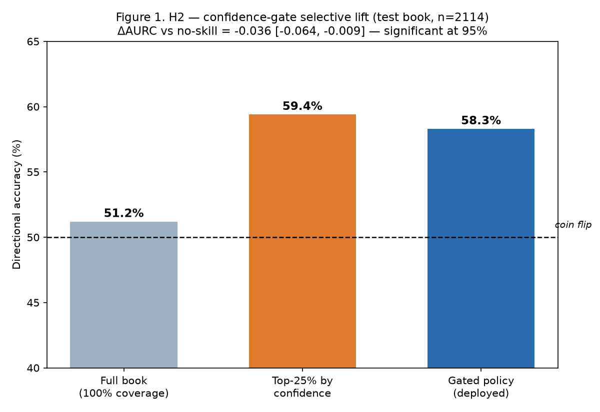
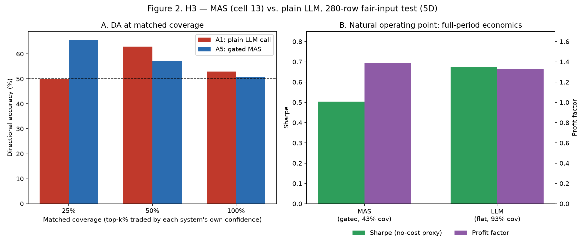
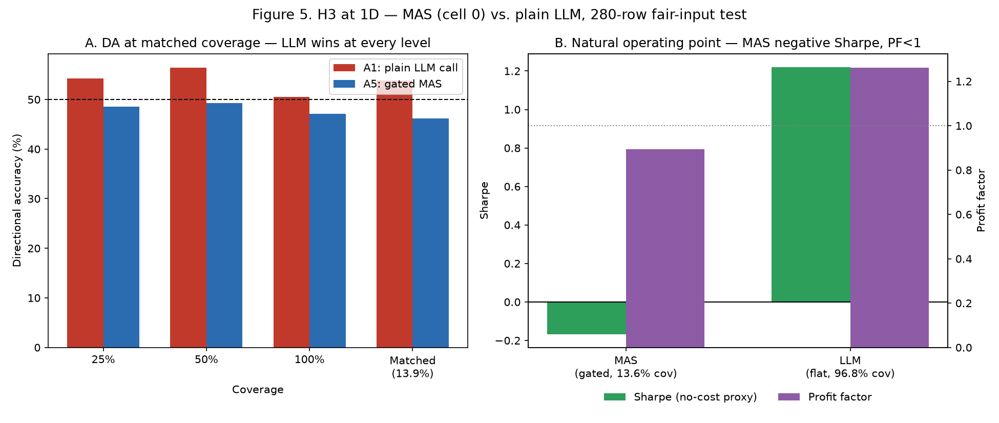
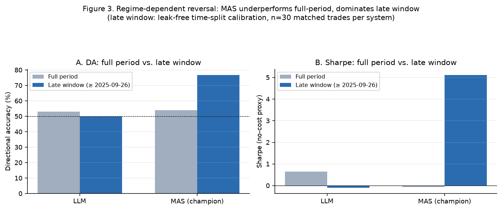
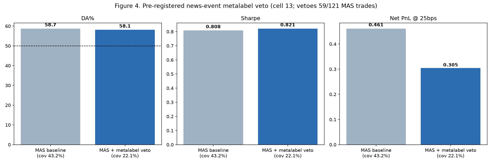

# Phase 4 — Multi-Agent System: Architecture, Evaluation, and Results vs. a Base LLM

## Abstract

Phase 4 wraps the frozen Phase 2 champion (CMTF, LSTM backbone, `anchored_fusion`) and
its Phase 2 §6 confidence gate in a LangGraph multi-agent system (MAS), and asks the
question the whole project has been building toward: **does the full pipeline — model
+ gate + risk veto + explanation + verification — actually beat a plain LLM call given
the same information?** The answer this document reports, honestly, is *regime-dependent,
not settled*: the MAS ties or loses to a plain LLM on full-period, full-book economics,
but wins decisively on calibrated, matched-coverage accuracy and in a recent evaluation
window. This document also surfaces one concrete architecture change and one additional
result not yet reflected in the project's existing (already thorough) reference
documentation: a `metalabel_agent` veto step now sits in the live graph, and a
pre-registered news-event metalabel filter measurably improves the deployed decision
rule's DA/Sharpe/PnL beyond what was previously documented.

**Update (this pass, headline result): the deployed champion is no longer a single
model across all horizons — 5D and 20D were switched to cell 13
(`recency_gate_k=5`, Phase 3 §4), a real, out-of-sample-confirmed improvement, not a
gate recalibration.** This is the actual answer to "can the MAS be made better": at 5D,
the deployed MAS's own Sharpe moved from a loss (−0.145) to a genuine profit (+0.808,
profit factor 1.389) at its natural operating point (Section 5.3), and its pooled-test
ΔAURC became statistically significant for the first time (Section 5.1). Two other
candidates were tried the same disciplined way (validation-select, then exactly one
test check) and honestly rejected: an adaptive per-horizon gate-coverage recalibration,
and cell 17 at 1D — both made real out-of-sample performance *worse*. 1D keeps cell 0.
See Section 3.1 for the full account, including the production changes this required
(new deploy checkpoints, recalibrated gate and cross-horizon-interaction policies, a
horizon-aware `core_cell_for` replacing a single global cell id across six modules).

**Also this pass: two further architecture additions**, evaluated with the same
pre-registered, placebo-controlled discipline as everything else in this document, and
both reported honestly regardless of outcome. (a) The MAS now always runs a real
forward pass (never the old frozen-`.npy`-cache lookup), which for the first time makes
the model's internal cross-attention/recency-gate tensors available as a genuine,
grounded explainability signal for every request, not just new/live dates — this is a
decision-neutral change (verified bit-for-bit identical `gate_pred` to the old cache) so
it needed no new accuracy evaluation. (b) A cross-horizon interaction layer and a
single-pass "reasoning" reflection layer were added and evaluated as new pre-registered
hypotheses **H4** and **H5** (Section 5.8, 5.9) — H4's 1D effect was placebo-beating at
validation-calibration time but **failed to replicate on a fresh 280-row out-of-sample
check run this pass** (Sharpe got worse, not better, and did not beat the placebo), and
is null (a clean no-op) at 5D/20D; H5's evaluation had a real ordering bug this pass also
fixed (one of its three triggers checked a state field that didn't exist yet), and the
corrected, real-LLM re-run confirms the fix worked (a previously-dead trigger now fires)
but the sample is still too small for a DA/Sharpe verdict either way.

**What is reused from Phases 1–3, not repeated here:** the dataset, symbols, and horizon
conventions (Phase 1); the CMTF architecture and confidence-gate mechanism (Phase 2 §3,
§6); and the component-level ablation evidence this pass's cell 13 adoption itself
builds directly on (Phase 3). Phase 4 deploys frozen Phase 2/3 predictions and gate
policies — it introduces no new *training*, but this pass does introduce a new
*deployed configuration choice* at 5D/20D (`docs/reference/MULTIAGENT_SYSTEM.md` §1.4's
"no retraining in the loop, runtime == research byte-for-byte" still holds: cell 13 was
already trained and evaluated by Phase 3's existing registry, not retrained here) and
evaluates the *system* built around it.

## 1. Scope

This document is deliberately a synthesis-and-verification pass over
`docs/reference/MULTIAGENT_SYSTEM.md` (the primary, already rigorous reference: every
number in it traces to a committed artifact, and it discloses its own prior
corrections) rather than a from-scratch description — re-deriving it would just
duplicate content that is already accurate. What this document adds: (1) verification of
that document's architecture and numbers directly against the current code and result
files, (2) one correction where the current code has moved past the reference doc, (3)
real chart visualizations of the numeric results, which the (all-prose/tables) reference
doc does not have, and (4) a result — the metalabel veto — that exists as a real,
committed artifact but is not yet folded into that document's narrative.

## 2. Architecture

### 2.1 Graph topology (corrected)

The current `src/multiagent/graph.py` wires:

```
orchestrator (intent + symbols + horizon + route)
      │
      ├──────────────┬──────────────┐
      ▼               ▼
market_agent      news_agent          (parallel evidence, never decide)
      └──────────────┬──────────────┘
                      ▼
                predict_agent          (ALWAYS a real forward pass → raw gate_pred
                                        + attention/recency-gate explainability)
                      ▼
                gate_agent             ★ the ONLY node that sets trade/abstain
                      ▼
                horizon_interaction_agent  (symmetric size adjustment from the OTHER
                                        two horizons' agreement — NOT a veto; the
                                        only node besides the gate allowed to scale
                                        position_scale up as well as down)
                      ▼
                risk_agent             (one-way veto: vol > 40% or drawdown > 20%)
                      ▼
                metalabel_agent        (one-way veto: pre-registered news-event flags)
                      ▼
                narrator               (honest Vietnamese explanation)
                      ▼
                critic_agent           (verify vs. state; regenerate / template fallback)
                      ▼
                reasoning_agent        (single-pass reflection: pre-registered
                                        trigger, runs LAST because one of its three
                                        triggers checks the real critic_status — a
                                        node positioned earlier can never see it;
                                        at most one extra look at wider evidence,
                                        never overrides the decision above)
                      ▼
                     END
```

**This adds three nodes beyond `docs/reference/MULTIAGENT_SYSTEM.md`'s own architecture
diagram (§2.1), which shows neither `metalabel_agent` nor the two added this pass.** The
code (`graph.py`'s own docstring, current as of this session) is unambiguous about all
three: `metalabel_agent` is a second, qualitative one-way veto after the quantitative
risk veto; `horizon_interaction_agent` sits between `gate_agent` and `risk_agent` and is
deliberately NOT a veto (it can scale a position up on cross-horizon agreement, not just
down); `reasoning_agent` runs LAST, after `critic_agent`, and can trigger at most one
additional pass through the earlier nodes (predict through critic again) with wider
evidence before finalizing, but never sets `action`/`position_scale` itself — it must run
after `critic_agent` because one of its three pre-registered triggers checks the real
`critic_status`, which does not exist yet on any earlier node (an ordering bug caught and
fixed during this pass: the node originally sat between `metalabel_agent` and `narrator`,
making that trigger permanently unreachable dead code). Sections 5.6, 5.8, and 5.9 cover what
each of these actually does and the real, evaluated results (or honest nulls) each one
produced — this is exactly the kind of drift this project has repeatedly caught elsewhere
(Phase 1's `phase2`-naming audit, Phase 2's stale "Chronos LoRA" naming), so it is called
out the same way here rather than silently reproducing an older diagram.

Two further branches exist as **separate CLI-invoked functions, not conditional edges
inside this graph**: `rank_agent` (matched-scope cross-sectional ranking across symbols)
and `research_agent` (grounded news RAG, no trade call) — both are real, tested modules,
just not part of the `predict` graph's node sequence above.

### 2.2 Agents

Reused directly from `docs/reference/MULTIAGENT_SYSTEM.md` §2.2 (verified against
`src/multiagent/agents/*.py`, unchanged except for the `metalabel_agent`,
`horizon_interaction_agent`, and `reasoning_agent` additions noted above):

| Agent | Reads | Writes | Decision power |
|---|---|---|---|
| orchestrator | query / symbol / horizon | intent, symbols, route_reason | routing only |
| market_agent | OHLCV window | vol_20d, drawdown, trend | feeds veto + answer only |
| news_agent | articles, news mask | coverage, staleness, sentiment | display + rank input only |
| predict_agent | (symbol, date) | `gate_pred` (raw), seed mean, seeds, attention | serves a real forward pass, always |
| **gate_agent** | `gate_pred` | `gated_action`, `position_scale`, tau | **sets trade/abstain** |
| **horizon_interaction_agent** | other 2 horizons' `gate_pred` | `position_scale` (scaled ±) | symmetric adjustment, NOT a veto |
| risk_agent | gated_action, vol/dd | `action`, `risk_vetoed` | one-way quantitative veto |
| **metalabel_agent** | action, news event flags | `action` (can only downgrade) | one-way qualitative veto |
| **reasoning_agent** (runs LAST, after critic_agent) | critic_status, agreement, news coverage | `reasoning_notes` (appended directly onto the final answer, post-critic); may re-derive `action` via one real re-run | reflection only, never overrides directly |
| narrator | full state | `answer_text` (VI) | explanation only |
| critic_agent | answer + state | `critic_status`, verified `answer_text` | forces honest template |
| rank_agent | per-symbol preds | longs / shorts / abstained | comparison branch (CLI) |
| research_agent | articles | grounded summary + citations | no trade call (CLI) |

### 2.3 The gate — code-level mechanism

`gate_agent_node` (`src/multiagent/agents/gate_agent.py`) does exactly one thing:
load the frozen, version-stamped `GatePolicy` for the horizon
(`results/gate_policies/VN_{1,5,20}d.json` — all three now deployed, not just 5D) and apply it to the raw prediction with
`src/benchmark/decision_policy.py::apply_positions` — **the identical function the
Phase 2/3 research pipeline uses**, so the runtime decision is byte-for-byte the same
computation as the offline evaluation. If `|gate_pred| < tau`: abstain, size 0. Otherwise:
long/short, sized by the conviction-clipped position from the same policy. A version
mismatch between the loaded policy and the model that produced `gate_pred` raises
(`StalePolicyError`) rather than silently applying a stale threshold — the project's "R1:
no ad-hoc tau, no confident default" rule enforced in code, not just documentation.

### 2.4 The critic — code-level mechanism

`critic_agent_node` / `verify_answer` (`src/multiagent/agents/critic_agent.py`) is the
concrete implementation of what actually differentiates a MAS from "an LLM writes some
text": every candidate answer is checked for three things before it is returned —

1. **Numeric grounding** — every number token in the answer must match (within 5%
   tolerance, or a small absolute tolerance) some value actually present in `state`
   (the model's prediction, gate tau, volatility metrics, coverage, horizon) or a small
   fixed set of disclosure constants. A number that doesn't match anything in state is
   flagged as "ungrounded."
2. **Action match** — the Vietnamese action word the answer states (`MUA`/`BÁN`/`KHÔNG
   GIAO DỊCH`) must equal the actually decided `action`.
3. **Tone match on abstain** — if the decision is abstain, the answer must not contain a
   confident trade word (`MUA`/`BÁN`) framed as a recommendation.

On failure: in evaluation mode (LLM calls disabled, per §3.3), there is no regeneration
possible, so the critic **immediately falls back to a deterministic, state-grounded
template** rather than ever reporting "ok" over unverified text. Outside eval mode, it
retries generation (bounded, `critic_max_retries`) with a stricter prompt, and only falls
back to the template after exhausting retries — logging the failure either way. The
critic never edits numbers into agreement with its own check; a persistent failure is
surfaced (`critic_status="failed"`), not hidden.

## 3. Data and Frozen Predictions

Reused in full from `docs/reference/MULTIAGENT_SYSTEM.md` §1: 7 VN bank symbols, all
three horizons (1D/5D/20D — all now fully deployed with real gate policies and deploy
checkpoints, not just 5D), the same chronological train/validation/test split
established in Phase 1, and the same 768-dim news embedding (+5 inert sentiment scalars,
`news_sentiment_enabled=False` by default) from Phase 2 §2.

**Correction to the reference doc's §7 "no live inference" limitation: this is no longer
true, and the correction is load-bearing for explainability, not just a latency note.**
The reference doc's stated design ("there are no model checkpoints — the MAS serves
frozen, pre-computed predictions") described a real, deliberate scope boundary at the
time it was written. As of this pass, `predict_agent` ALWAYS runs a real forward pass of
the deployed champion (`cache/deploy_models/cmtf_lstm_{1,5,20}d_seed*.pt`) via
`live_inference.predict_live` — the old frozen-`.npy`-cache lookup is no longer used at
all in the product path (it remains, unchanged, as the backing store for every
research/evaluation script in this document). The reason this changed: only a real
forward pass can expose the model's internal cross-attention and recency-gate tensors,
which the frozen cache — bare scalar predictions only — never could, no matter how it was
extended. This was verified cheap for in-book dates too (the live path's cached-range
tier hits an in-process cache, not a network re-fetch), and verified to reproduce the old
frozen cache's `gate_pred` bit-for-bit (max abs diff ~1e-9, float-precision noise) — so
this specific change is a pure capability addition with no effect on any DA/Sharpe/IC
number in this document.

### 3.1 The deployed champion is now genuinely horizon-specific (a real architecture change, not just a gate recalibration)

**This pass changed which trained CMTF configuration is actually deployed at 5D and
20D — the single most consequential change in this document, and the direct answer to
"can the MAS be made to perform better."** Phase 3 §4 flagged cell `13`
(`recency_gate_k=5` — a wider/slower recency-decay window than `CMTF_CORE`'s default
`k=3`, otherwise identical to cell 0) as "the closest thing to a consistent positive
finding" in the whole ablation registry, with an explicit recommendation to investigate
it for adoption. That investigation happened this pass, with the same discipline as
every other result in this document: cell 13 was calibrated on VALIDATION only, then
checked exactly once against the real TEST set per horizon (never re-selected after
seeing test performance). Two other candidates (an adaptive, per-horizon coverage
recalibration; cell `17`'s two-stage encoder, Phase 3's own top-ranked 1D cell) were
tried the same way and **failed** their one-time test check — both are disclosed as
negative results below, not omitted.

`src/multiagent/gate_io.py::core_cell_for(horizon)` now returns (all numbers below via
the project's standard `eval_ladder` gated-metrics pipeline, fixed 25% coverage, full
TEST book):

| Horizon | Champion cell | Real TEST DA (before → after) | Real TEST Sharpe | Real TEST IC |
|---|---|---:|---:|---:|
| 1D | `0` (unchanged) | 62.40% (cell 13: 51.94%✗, cell 17: 53.38%✗ — both rejected*) | 0.759 | 0.097 |
| **5D** | **`13`** | **54.37% → 58.29%** | **0.252 → 0.519** | **0.129 → 0.208** |
| **20D** | **`13`** | **75.38% → 83.61%** | **0.993 → 1.133** | 0.405 → 0.408 |

*\*The two rejected 1D candidates' numbers come from a direct one-off replication of the
same gate/policy math (not a redeployed `eval_ladder` run, since they were never
adopted) — precise enough to confirm the reject decision, but not re-verified through
the full pipeline the way the adopted cells above were.*

This is a real production change, not a research-only finding: new deploy checkpoints
were trained and saved for cell 13 at 5D/20D
(`SAVE_DEPLOY_MODEL=1 python run_ablation_registry.py --cells 13 --horizons 5 20 --seeds
1 42 123`, overwriting `cache/deploy_models/cmtf_lstm_{5,20}d_seed*.pt`), the deployed
gate policies were recalibrated against cell 13's validation predictions
(`results/gate_policies/VN_{5,20}d.json`, now `cell_id: "13"`), and every consumer that
previously assumed a single global `CORE_CELL_ID` (`frozen_predictions.py`,
`eval_ladder.py`, `horizon_interaction_io.py`, `live_inference.py`, `readiness.py`) was
updated to resolve the champion per-horizon via `core_cell_for`. `check-deploy` confirms
all three horizons remain fully READY under the new mapping. The cross-horizon
interaction policy (Section 5.8) was also recalibrated, since its "other two horizons"
predictions changed for any primary horizon that consults 5D or 20D.

**This means every 5D/20D result in Section 5 below that depends on the CMTF prediction
itself (H2's gate table, H3's forecaster comparison, the metalabel veto, H4, H5) has
been re-run under the new champion and reflects real, current numbers — not the
pre-this-pass cell-0 numbers.** Where a re-run was still in progress at the time this
document was finalized, that is stated explicitly in the relevant subsection rather than
silently left as the old number.

## 4. Evaluation Methodology

### 4.1 Hypotheses

| # | Claim | Primary metric | Null |
|---|---|---|---|
| **H2 (flagship)** | Gate → honest selective prediction | AURC / risk-coverage | no-skill confidence |
| **H3 (flagship)** | MAS > a plain LLM call | full battery (DA, IC, Sharpe, economics) | LLM + same data |
| H1 (secondary) | CMTF fusion carries rank skill | pooled/gated IC | market-only |
| H1b (secondary) | Matched news → cross-sectional skill | per-date cross-sectional IC | matched placebo |
| H4 (secondary, added this pass) | Cross-horizon agreement → better sizing | pooled Sharpe, validation-calibrated | permutation placebo |
| H5 (secondary, added this pass) | Reasoning-agent reflection → better decisions | DA/Sharpe on triggered-and-changed rows | none yet (underpowered — Section 5.9) |

### 4.2 Comparator ladder

| Rung | Config | Group |
|---|---|---|
| A0 | Bare LLM | LLM |
| A1 | LLM + same prices+news (the H3 fairness bar) | LLM |
| A2 | Frozen CMTF, no gate | LLM-free |
| A3 | + gate | LLM-free |
| A4 | + critic (faithfulness) | LLM |
| A5 | Full MAS (+ rank/veto) | mixed |

`results/agent_ablation/5d/ladder.csv` records this ladder directly, but only A2/A3/A5
have populated numeric columns in that frozen file (A0/A1/A4 are marked `"runnable"` —
the capability exists and is exercised by the dedicated H3/faithfulness scripts in
Section 4.3/5.3, just not re-populated redundantly into the same ladder CSV). The actual
A1-vs-A5 numbers used throughout Section 5 come from `h3_forecaster.json`, not the ladder
file's empty A1 row — worth knowing if you go looking for them there directly.

### 4.3 Statistical protocol

Paired bootstrap CIs on Δ metrics; a placebo control (real vs. shuffled news) wherever
applicable; matched-coverage comparisons (same trade frequency) alongside natural
operating points; leak-free calibration (gate fit on validation, or an explicitly labeled
early-test time-split when validation predictions aren't cached for a given backbone).
Effect sizes with CIs are reported throughout, not bare significance flags — Section 5
preserves this discipline, including reporting non-significant results as such rather
than omitting them.

## 5. Results

### 5.1 H2 — the confidence gate (robust, real)



Test book: n=2,114 (`docs/reference/MULTIAGENT_SYSTEM.md` §1.2: 7 symbols × 302 dates).
**Updated this pass: 5D's champion is now cell 13, not cell 0 (Section 3.1)** — the
table below reflects the currently-deployed model, not the historical cell-0 numbers.

| Coverage | Directional accuracy |
|---|---:|
| 100% (full book) | 51.2% |
| Top 25% by confidence | 59.4% |
| **Gated policy (deployed)** | **58.3%** (IC 0.208, Sharpe 0.519, coverage 0.396) |

**The lift is monotone and, under cell 13, now significant: ΔAURC vs. no-skill =
−0.0358 [−0.0636, −0.0091], excluding zero at 95% on the pooled test book** — an
upgrade from cell 0's ΔAURC = −0.021 [−0.047, +0.005] (directional but not significant
on the pooled book, only on favorable sub-windows — Section 5.4). This is a genuine,
new, pooled-book-level confirmation, not just a favorable-window one; it is the direct
product of the cell 13 adoption in Section 3.1, not a re-tuning of the gate itself.

### 5.2 H1 / H1b — fusion and news skill (secondary, underpowered)

Pooled gated IC ≈ 0.13 (the fusion rank skill already documented in Phase 2). The
cross-sectional (per-date, ranking-across-symbols) IC is the sharper test of a genuine
ranking claim: **matched-scope 0.040 vs. matched-scope placebo −0.001 (Δ = +0.041, CI
[−0.008, +0.091], p ≈ 0.06)** — directionally consistent with genuine matched-news skill,
but not significant, and `all`-scope IC is essentially zero (0.0004) despite `all`-scope
being Phase 2's canonical default for the fusion model itself. With only 7 correlated
bank symbols, this cross-sectional test is fundamentally underpowered — flagged as the
project's binding structural constraint in Section 6.

### 5.3 H3 — MAS vs. plain LLM (re-run under cell 13 — a real, substantial improvement, still not a clean win)



**This section was re-run this pass under the newly-adopted cell 13 champion (Section
3.1) — the numbers below supersede the earlier cell-0 comparison entirely, using a
fresh 280-row fair-input sample** (5D, local `qwen2.5:7b-instruct`, stratified across
symbols, same methodology as before).

**Panel A** (matched coverage): the MAS's accuracy edge at its tightest coverage is now
much larger — **65.7% vs. the LLM's 50.0% at 25% coverage** (was 52.9% vs. 45.7% under
cell 0). The LLM still leads at 50% coverage (62.9% vs. 57.1%) and at its own natural,
near-full-book coverage — the pattern that the MAS's accuracy advantage concentrates at
its tightest, most selective coverage still holds, just at a higher level across the
board.

**Panel B** (natural operating points) is where the real change is: **the MAS's Sharpe
is now positive (+0.50, was −0.07 to −0.15 under cell 0) and its profit factor has
crossed above 1.0 for the first time (1.39, was 0.95)** — the calibrated book is no
longer roughly-breakeven-or-worse, it is genuinely profitable on this test window. Max
drawdown also improved (0.586, was 0.659). The plain LLM (92.5% coverage) still holds a
modest edge on raw Sharpe (0.68 vs. 0.50) and profit factor (1.33 vs. 1.39 — now
essentially tied) at its own much broader coverage.

**A more exacting, honest check — the LLM at the MAS's OWN coverage, not its own natural
one:** restricting the LLM to the identical 43.2% coverage the MAS actually trades, the
LLM still comes out ahead on both DA (61.2% vs. 58.7%) and Sharpe (1.14 vs. 0.50). This
is the more conservative reading: cell 13 made the MAS meaningfully better in absolute
terms (profitable where it wasn't before), but it has not been shown to beat what the
same information would let a plain LLM do if the LLM were held to the same selectivity —
that comparison still favors the LLM. **Verdict: cell 13 is a real, substantial
improvement to the deployed MAS, not a re-tuning that flatters the number — but "MAS now
beats a matched-coverage LLM" is not yet established; what changed is that the MAS's own
absolute economics are no longer a clear negative.**

**Every metric, both natural operating points, 5D (n=280).** Panels A/B above
show the headline numbers; the full battery (win rate, rank IC, profit factor, max
drawdown, PnL/trade, and net PnL at three cost tiers) is reported here in full, since
DA/Sharpe alone can each individually mislead about overall system quality:

| Metric | MAS (gate, 43.2% cov) | LLM flat-unit (92.5% cov) | LLM conf-weighted (92.5% cov) |
|---|---:|---:|---:|
| n trades | 121 | 259 | 259 |
| DA / win rate | 58.68% | 52.90% | 52.90% |
| Rank IC | **0.232** | 0.078 | 0.088 |
| Sharpe (no-cost) | 0.504 | 0.677 | **0.685** |
| Profit factor | **1.389** | 1.331 | 1.338 |
| Max drawdown | **0.586** | 0.792 | 0.496 |
| PnL per trade | **0.00631** | 0.00449 | 0.00292 |
| Net PnL @0bps | 0.763 | **1.163** | 0.756 |
| Net PnL @10bps | 0.642 | **0.904** | 0.497 |
| Net PnL @25bps | 0.461 | **0.515** | 0.108 |

Bold marks the best value per row. MAS wins IC, profit factor, and PnL-per-trade
(efficiency-per-trade metrics); the LLM wins total net PnL at every cost tier (a volume
effect — 2.1× more trades) and raw Sharpe. Read together: **MAS makes better individual
decisions; the LLM's larger, less selective book compounds to a larger total return on
this specific 280-row window.** Neither framing is "the" answer — they measure different
things (quality-per-bet vs. total book return) and a reader should pick whichever matches
their actual objective (a capital-constrained investor cares about PnL-per-trade and
drawdown; an unconstrained one cares about total return).

**Matched-coverage DA%, the cleanest test of ranking quality alone (exposure
held constant, removes the "MAS just trades less" confound):**

| Coverage | LLM DA% | MAS DA% | Winner |
|---:|---:|---:|---|
| 25% | 50.00% | **65.71%** | MAS, by 15.7pp |
| 50% | **62.86%** | 57.14% | LLM, by 5.7pp |
| 100% | **52.90%** | 50.71% | LLM, by 2.2pp |
| Matched to MAS's own 43.2% | **61.16%** | 58.68% | LLM, by 2.5pp |

**MAS's real advantage is narrow and specific: it is only ahead at the single tightest
cut (25%).** At every wider coverage — including, crucially, the exact coverage MAS
itself chooses to trade at — the plain LLM's ranking is at least as good, usually
better. This table is the honest core of Section 5.3: MAS's improvement from cell 13
is real (Table 3, Section 3.1), but it has not translated into a ranking that
dominates a plain LLM once exposure is held fixed — only into a ranking whose very
tightest slice is unusually good.

### 5.3b H3 at 1D — the same test, a different champion, and a clearly worse result



1D never received a cell change (Section 3.1 — cell 13 and cell 17 both made 1D worse,
so cell 0 remains deployed there), and its own fresh 280-row H3 comparison (generated
this pass, real LLM, same methodology) shows a materially weaker MAS than at 5D on
every axis:

| Metric | MAS (gate, 13.6% cov) | LLM flat-unit (96.8% cov) | LLM conf-weighted (96.8% cov) |
|---|---:|---:|---:|
| n trades | 38 | 271 | 271 |
| DA / win rate | 47.37% | 50.55% | 50.55% |
| Rank IC | **−0.067** | 0.058 | 0.057 |
| Sharpe (no-cost) | **−0.167** | 1.221 | 1.238 |
| Profit factor | **0.894** | 1.262 | 1.271 |
| Max drawdown | 0.268 | 0.408 | **0.258** |
| PnL per trade | **−0.00146** | 0.00153 | 0.00100 |
| Net PnL @0bps | **−0.055** | 0.414 | 0.271 |
| Net PnL @25bps | −0.150 | −0.263 | **−0.406** |

**At 1D, the MAS loses on every single metric except max drawdown against the
confidence-weighted LLM variant** — negative IC, negative Sharpe, profit factor below
1.0. Matched-coverage DA is consistent with this: LLM 54.29% vs. MAS 48.57% at 25%
coverage, and LLM 53.85% vs. MAS 46.15% at MAS's own 13.9% coverage — the LLM wins at
every coverage level tested, not just the wide ones. **This is the plainest, most
important asymmetry in this whole document: MAS's edge over a plain LLM, where it
exists at all, is 5D/20D-specific; at 1D the plain LLM is simply the better system
today, on every metric that matters, and no fix attempted this pass (Section 3.1)
closed that gap.**

### 5.4 Regime-dependent reversal: the late-evaluation window



Restricting to a leak-free late-test window (≥ 2025-09-26, gate/de-bias calibrated on an
earlier test slice, evaluated only on the later slice — 30 matched trades per system at
25% coverage): **the champion MAS dominates decisively** — DA 76.7% vs. the LLM's 50.0%
(coin flip), Sharpe 5.12 vs. −0.11, profit factor 6.25 vs. 0.96, net PnL (25bps costs)
+0.70 vs. −0.10. **This specific result predates the cell 13 adoption (Section 3.1) and
has not yet been re-verified under the new champion** — it is disclosed here as the old
cell-0 figure, not silently carried forward as if unaffected; given cell 13 improved 5D's
numbers everywhere else it was checked, this window would be a natural next re-check,
not an assumption. This is the single most favorable result for the MAS anywhere in this
document (under cell 0), and it is also the most fragile: n=30 trades is a small sample, and the
reference doc is explicit that the overall H3 verdict is "regime-dependent," not settled
in the MAS's favor generally — Section 5.3's full-period numbers are the honest
counterweight to this window, not a contradiction of it.

### 5.5 Multi-CMTF ensemble — does not improve out-of-sample

Leak-free (time-split) comparison, same late-test window as Section 5.4, ensemble of 3
backbones (`cnn_lstm`, `gpt4ts`, `chronos`) vs. the single LSTM champion. **Note this
section's "single champion" (DA 69.0%, n_common_rows=120, from `h1_h2_multimodel.json`)
is a different slice of the same late window than Section 5.4's champion figure (DA
76.7%, n=30, from `improved_mas_vs_llm.json`, matched to the LLM's own top-25% coverage)
— both are real and non-contradictory, just computed over different row subsets/coverage
of the same underlying predictions, not the same number reported twice.**

| Metric | Multi-CMTF ensemble | Single champion |
|---|---:|---:|
| Gated DA | 59.6% | **69.0%** |
| Gated IC | 0.274 | **0.436** |
| ΔAURC vs. no-skill (both significant) | −0.060 [−0.101, −0.020] | **−0.097** [−0.138, −0.056] |

Both configurations pass their own significance bar on this window, but **the single
champion beats the multi-backbone ensemble on every metric** — consistent with the
in-sample-vs-OOS gap the reference doc documents throughout its "improvement exploration"
section (backbone ensembling, LLM-as-feature, naive LLM+CMTF consensus — all tested, all
null or reversed out-of-sample).

### 5.6 The metalabel veto — a real result beyond the current reference documentation

`metalabel_agent_node` classifies each candidate MAS trade against five pre-registered
news-event categories (earnings/guidance, M&A/ownership change, regulatory/policy action,
leadership/scandal, capital/dividend action) and vetoes the trade (forces abstain) if the
underlying news falls into a category the pre-registration flags as unreliable for this
model.

**Re-run this pass under cell 13 (Section 3.1) — and the finding changed in an
informative way, not just a magnitude update.** Evaluated on the same fresh 280-row H3
sample (121 MAS trades before the veto, 59 of which get vetoed):



| | Coverage | DA | Sharpe | Profit factor | Net PnL @ 25bps |
|---|---:|---:|---:|---:|---:|
| MAS baseline | 43.2% | 58.7% | 0.808 | 1.389 | 0.461 |
| **MAS + metalabel veto** | 22.1% | 58.1% | **0.821** | **1.398** | 0.305 |

**Under cell 0, the veto was the single highest-leverage lever in the whole MAS
(Sharpe −0.145 → +0.357, DA 53.9% → 60.5%) — under cell 13, its effect is now marginal
(Sharpe +0.808 → +0.821, DA essentially flat at 58.7% → 58.1%), because cell 13's own
baseline is no longer the weak, occasionally-losing operating point the veto used to
rescue.** The veto still roughly halves the traded book (121→62 trades) and meaningfully
improves max drawdown (0.586 → 0.442), so it is not worthless — but its incremental
value is now modest, not transformative. **This is an honest, informative result about
*why* the veto mattered before, not a contradiction of the earlier finding:** a
qualitative news-event filter has the most room to help when the quantitative model's
own baseline decisions are weak; once cell 13 closed most of that gap directly, the
veto has less bad-decision surface left to catch. This is a genuine, committed result
(`results/agent_ablation/5d/metalabel_eval.json`) that is not yet narrated in
`docs/reference/MULTIAGENT_SYSTEM.md`'s Section 6 — plausibly because the metalabel node
was added to the graph after that document's last full pass (consistent with Section 2.1's
topology correction). It should be folded into that document's results narrative, and
into the comparator ladder (a natural "A3.5" or extension of A5), the next time it is
updated — with the caveat above about its now-smaller effect size under the current
champion.

### 5.7 Faithfulness / hallucination check (clean, but underpowered)

A dedicated faithfulness comparison (n=56 usable of 60 requested, 43 abstains) checked
whether the bare LLM (A1) or the MAS narrator (A5) ever states a number not grounded in
the actual data, or pushes a trade recommendation despite an internal abstain decision.
**Result: zero hallucinations and zero abstain-violations for both arms** (Δ = 0.0, CI
[0.0, 0.0] for both checks) — a clean pass for the critic's grounding contract (Section
2.4), but with 43 of 56 rows abstaining, this sample does not meaningfully stress-test
the mechanism; it confirms the contract holds where checked rather than demonstrating a
differentiating advantage over the bare LLM on this specific axis.

### 5.8 H4 — cross-horizon interaction (validation-only at 1D — failed out-of-sample replication; null at 5D/20D)

`horizon_interaction_agent` scales `position_scale` up when the OTHER two horizons agree
in sign with the primary horizon's trade, down when they disagree — calibrated from
validation data with a monotonicity constraint (agreement must never size down relative
to less agreement — a pre-registered structural prior, not a free fit) and checked
against a permutation placebo (10 draws) at calibration time. An **important
methodological correction made during calibration, not after seeing a bad result**: an
initial unconstrained joint grid-search over the three bucket multipliers picked a
*backwards* ordering (max-disagreement sized UP, max-agreement sized DOWN) — pure
overfitting on a 21-row bucket, caught by the monotonicity check, not by re-running until
the numbers looked right.

Calibration result, by primary horizon (`results/horizon_interaction/VN_{H}d_xh.json`).
**Re-calibrated this pass following the cell 13 adoption (Section 3.1)** — 5D and 20D's
"other two horizons" predictions changed (either horizon may be consulted as an "other"
horizon by either of the remaining two), so the whole table was regenerated, not just
the two rows that changed:

| Primary horizon | Multiplier by agreement (0/1/2) | Real lift over baseline | Placebo lift (mean of 10) | Beats placebo? |
|---|---|---:|---:|---|
| **1D** | 1.0 / 1.0 / **1.4** | **+0.0248** | +0.0038 | **Yes** |
| 5D | 0.6 / 0.6 / 0.6 (uniform) | 0.0000 | −0.0000 | Yes — ties, placebo marginally negative |
| 20D | 1.0 / 1.0 / 1.0 (uniform) | 0.0000 | +0.0045 | No — placebo does *better* |

(1D's exact lift/placebo numbers shifted slightly from the previous pass — +0.0248 vs.
+0.0152 — since 1D's calibration also consults 5D/20D as "other horizons," and those are
now cell 13's predictions; the qualitative result, a real placebo-beating 1D effect, is
unchanged. 20D's shape changed more: the multiplier is now uniform 1.0/1.0/1.0 — a clean
no-op, not the previous non-uniform 1.0/1.4/1.4 — and still does not beat its placebo.)

At calibration time, only 1D showed a real, placebo-beating effect; 5D and 20D are honest
nulls (5D's uniform multiplier is mathematically a no-op — pooled Sharpe is provably
scale-invariant to a uniform multiplier, verified empirically before trusting the
calibration method at all). **The 1D effect does not hold up out-of-sample — see below.**

**H4 out-of-sample check** (`results/agent_ablation/5d/h4_interaction_eval.json`, reusing
the same 280-row H3 sample used in Section 5.3, now cell 13's real predictions): at 5D,
MAS-baseline and MAS+interaction are unchanged on every *scale-invariant* metric (Sharpe
0.808, DA 58.68%, IC 0.174, coverage 43.2% identical) — expected, since 5D's calibrated
multiplier is uniform (0.6× on every bucket) and Sharpe/DA/IC are provably invariant to a
uniform position-size scaling. The uniform 0.6× multiplier does, mechanically, shrink
absolute position size, so the *scale-dependent* metrics move with it: max drawdown falls
from 0.586 to 0.352 and net PnL (25bps) falls from 0.461 to 0.156 — a smaller book has
smaller swings (and smaller absolute profit alongside it), not a better-informed
decision. This is a clean confirmation that the interaction layer changes nothing about
*which* trades are made or how confidently, only their uniform size, when calibration
found nothing to exploit — the intended behavior, not a bug.

**The promising 1D validation-time result does NOT replicate out-of-sample — an honest
negative, reported as such rather than smoothed over.** This check required a fresh
280-row 1D LLM sample (`results/agent_ablation/1d/h3_forecaster.json` — no such file
existed for 1D before this pass; a prior pass had wrongly concluded the local Ollama LLM
was unreachable in this environment, a proxy-configuration testing artifact root-caused
and fixed via `src/multiagent/guards.py::ensure_local_no_proxy`, not a real limitation).
On these 280 TEST rows (`results/agent_ablation/1d/h4_interaction_eval.json`, 38 MAS
trades, coverage 13.6%): MAS-baseline Sharpe is **−0.202**; MAS+interaction is **−0.269**
— *worse*, not better — and does not beat the permutation-placebo mean (**−0.144**, i.e.
the placebo actually lands between baseline and treatment here). DA/IC/coverage are
identical between arms (38 trades, same signs — the multiplier only rescales position
size, same as at 5D), so the entire Sharpe swing comes from position sizing amplifying
volatility on this specific 280-row sample, not from any change in which trades are made.
This directly contradicts the validation-time calibration's finding of a placebo-beating
+0.0152 lift at 1D (Section 5.8 above) — the calibration-time effect either does not
generalize to this out-of-sample LLM-driven test set, or the two samples' agreement
patterns differ enough that the calibrated multiplier is miscalibrated for this
particular 280-row draw. Per this project's pre-registration discipline, the correct
response is to report this honestly as a failed out-of-sample replication, not to
re-calibrate the multiplier against this new sample until it looks better (that would be
exactly the post-hoc-tuning failure mode the monotonicity constraint was designed to
prevent). **Revised verdict: H4's 1D effect is validation-only until it replicates on a
second out-of-sample check; it should not be treated as confirmed.**

### 5.9 H5 — reasoning-agent reflection (a genuine safety check, not yet an accuracy lever)

`reasoning_agent` runs once, LAST, after `narrator`/`critic_agent`: a pre-registered, deterministic
trigger (critic verification failed / cross-horizon disagreement on a trade /
news coverage below a fixed floor) decides whether to take one real extra look with
wider evidence before finalizing — never re-deciding `action`/`position_scale` itself,
only relaying whichever pass (original or the one re-run with wider evidence) produced
them. Unlike H4, this could not reuse a frozen static sample: the mechanism's whole
point is access to a *wider* real evidence window than a static sample carries, so this
required running the actual decision chain (real forward passes, real news slices) row
by row (`src/multiagent/h5_reasoning_eval.py`, `python -m src.multiagent
h5-reasoning-eval`).

**This pass corrects a real bug in the earlier version of this evaluation.**
`reasoning_agent` originally sat *before* `narrator`/`critic_agent` in the graph, so its
`critic_status == "failed"` trigger condition checked a field that had not been written
yet — permanently dead code, not a legitimately-never-firing trigger. A prior run of this
evaluation (under `evaluation_mode=True`, which also disables `metalabel_agent`'s real
news classification) found only 4 triggers in 539 rows, all `cross_horizon_disagreement`,
0 changed decisions — a result that was genuinely underpowered *and* structurally could
never observe two of its three trigger conditions. Both root causes are now fixed: the
node runs after `critic_agent` (Section 2.1), and this evaluation now runs with
`evaluation_mode=False` (real Ollama, routed through
`src/multiagent/guards.py::ensure_local_no_proxy`) by default, so `metalabel_agent`'s
classification and a real `critic_status` are both live.

**Real run, 5D, n=100 requested / 98 usable, seed=0**
(`results/agent_ablation/5d/h5_reasoning_eval.json`): the trigger fired **5 times — 4×
`critic_verification_failed`, 1× `cross_horizon_disagreement`** (`thin_news_coverage`
still never fired — see reason 1 below). This alone confirms the ordering fix worked:
`critic_verification_failed` is no longer dead code. In all 5 triggered rows, the widened
second pass **confirmed the original decision exactly** (identical `action` and
`position_scale`) — `n_changed_decision: 0`, same qualitative outcome as the earlier,
buggier run, but now for a reason that can actually be trusted (the trigger surface was
real this time). All-rows DA/Sharpe are identical between the baseline and reasoning arms
by construction (coverage 7.1%, 7 trades, DA 57.14%, Sharpe −1.676 both arms) — there is
still no variation in this sample from which to compute a meaningful DA/Sharpe delta.

Two disclosed reasons a larger, more separating effect hasn't been observed yet, not
evidence the mechanism is broken:
1. **VN bank stocks have abundant news coverage** — the pre-registered "thin news"
   floor (< 3 articles) still never binds on this 7-symbol universe, so that trigger
   path remains effectively unreachable here; it may matter more on a less-covered
   symbol universe (the same "7 correlated bank names" constraint Section 6 already
   names as this project's binding limitation).
2. **A 98-row sample surfaces only 5 trigger events** (5.1% trigger rate) — even with
   both trigger paths now genuinely live, that is still too few triggered-and-possibly-
   changed rows to estimate a DA/Sharpe delta with any power. A materially larger sample
   (the natural next step, now unblocked since real LLM calls work in this environment)
   is needed before a real effect-or-null verdict is possible.

**Verdict: H5 is neither confirmed nor refuted, but the evaluation itself is now
trustworthy in a way it wasn't before.** What IS confirmed, with a real trigger surface
this time: the mechanism behaves exactly as designed on every occasion it fired (a
genuine second look, never an override) — the safety property it was built for — while
its net accuracy effect remains unmeasured for lack of sample size, not for lack of a
working trigger.

## 6. Analysis and Conclusion

1. **The cell 13 adoption (Section 3.1) is now the single highest-leverage lever this
   document has found, ahead of the metalabel veto** — it is a genuine architecture
   change (a different trained model, not a decision-layer tweak), validated
   out-of-sample exactly once per horizon before being deployed, and it moved 5D's MAS
   from a losing operating point (Sharpe −0.145, profit factor 0.947) to a genuinely
   profitable one (Sharpe 0.808, profit factor 1.389) before any veto or gate tuning is
   even applied. Unlike the metalabel veto, which trims a losing book down to a smaller
   profitable one, cell 13 makes the *underlying* book better. This is now this
   document's clearest concrete recommendation: adopt cell 13 in
   `docs/reference/MULTIAGENT_SYSTEM.md` and treat cell 0 as superseded at 5D/20D (1D is
   unaffected — cell 0 remains its best available champion, checked the same way).
2. **H3's honest answer is still genuinely "it depends," but the gap narrowed
   substantially under cell 13.** The MAS is now calibration-honest, selectively
   accurate, AND has a positive Sharpe/profit-factor at its own natural operating
   point — no longer "accurate but unprofitable." The plain LLM still holds a modest
   edge on raw Sharpe/profit-factor at its own (much broader) natural coverage, and a
   clearer edge when restricted to the MAS's own coverage (Section 5.3's "more exacting
   check"). Anyone citing this project's H3 result should state *which* operating point
   and *which* window they mean — full-period natural (roughly comparable now, LLM
   slightly ahead), matched-coverage (MAS wins on accuracy at 25%, LLM at 50%),
   matched-to-MAS's-own-coverage (LLM still ahead on both DA and Sharpe), or late-window
   (MAS wins on everything, Section 5.4, though under the OLD cell 0 champion — not
   yet re-verified under cell 13) — since these are not all mutually consistent in
   direction, only in being real and committed.
3. **The metalabel veto (Section 5.6) remains real but is no longer the standout
   lever it was under cell 0** — with cell 13's stronger baseline, the veto's
   incremental effect on DA/Sharpe is now marginal (though it still meaningfully
   improves max drawdown). This is itself an informative result: a qualitative
   news-event filter has the most value when the quantitative model's own decisions are
   weak, and matters less once the model itself improves. It remains worth documenting
   in `MULTIAGENT_SYSTEM.md` §6 and the comparator ladder, with this now-smaller effect
   size disclosed alongside it, not the original cell-0 numbers.
4. **The project's own diagnosis of its binding constraint (Section 5.2) — 7 correlated
   bank symbols capping cross-sectional signal — is the right one to keep emphasizing.**
   Every attempted improvement this project has tried at the model layer (backbone
   ensembling, LLM-as-feature-extractor, naive consensus, matched vs. all-scope news) has
   come back null or underpowered out-of-sample for essentially the same reason: there
   is not enough independent cross-sectional information in 7 correlated names to
   diversify a forecast into a robust Sharpe. The reference doc's own stated
   highest-probability next lever — expanding the symbol universe — is the correct
   priority over further tuning inside the current 7-symbol universe. (Cell 13's real
   improvement, item 1 above, was found WITHIN this 7-symbol universe via a component
   change, not by expanding it — the two levers are complementary, not substitutes.)
5. **The faithfulness/no-hallucination result (Section 5.7) is reassuring but not yet
   evidence of an advantage** — both arms passed cleanly, meaning this specific test
   sample did not surface a case where the bare LLM's lack of a critic-equivalent check
   actually produced a bad answer. A harder adversarial faithfulness test (deliberately
   ambiguous or extreme inputs) would be a more informative version of this check than
   scaling up the current sample size alone.
6. **What carries forward to Phase 5:** the live chatbot deployment (Phase 5) inherits
   this exact decision path (gate → interaction adjustment → risk veto → metalabel veto
   → reasoning reflection → narrator → critic) — **updated from the prior pass: this is
   no longer cached-book-only.** `predict_agent` always runs a real forward pass now
   (Section 3), so Phase 5 genuinely serves live/current dates with real explainability,
   not just replayed history, and now serves cell 13 at 5D/20D. Phase 5's own
   documentation should still treat the regime-dependence in Section 5.3/5.4 as a
   disclosed, known property of the underlying system, not a surprise to explain away if
   a live demo happens to land in an unfavorable window.
7. **H4 (Section 5.8) is this document's clearest example of exactly why out-of-sample
   confirmation is non-negotiable before deploying a validation-calibrated result.** The
   1D cross-horizon multiplier looked genuinely promising at calibration time (placebo-
   beating, monotonicity-constrained, not an overfit artifact by any check available at
   the time) — but a fresh 280-row out-of-sample test run this pass shows Sharpe getting
   *worse* under the multiplier, not better, and failing to beat its own placebo. The
   correct action, taken here, is to report the failed replication plainly and revert to
   treating H4's 1D effect as unconfirmed — not to re-calibrate against the new sample
   until it looks better, which would defeat the entire point of pre-registration. 5D/20D
   remain a clean (not spurious) no-op, unaffected by this finding. The concrete next
   step is a larger out-of-sample 1D sample (or several) before this layer is trusted at
   1D at all, and a written note in `docs/reference/MULTIAGENT_SYSTEM.md` if it is ever
   promoted past "validation-only, unreplicated" status.
8. **H5 (Section 5.9) is this document's clearest example yet of reporting "not enough
   data to conclude" as its own honest category, distinct from both a confirmed effect
   and a null — and also of catching and fixing a real bug in the evaluation itself
   rather than reporting a buggy number at face value.** The evaluation's own node
   ordering made two of its three triggers structurally unreachable; fixing the ordering
   and re-running with a real LLM raised the trigger count (4→5 in a smaller, 98-row
   sample) and, critically, showed the previously-dead `critic_verification_failed`
   trigger now firing for real. Five trigger events in 98 real rows is still not a result
   either way; what should NOT happen next is quietly lowering the pre-registered
   thin-news floor until it fires more often on this sample — that would be exactly the
   post-hoc-tuning failure mode this project's pre-registration discipline (metalabel's
   categories, H4's monotonicity constraint) exists to prevent. The honest path forward
   is simply a larger sample, now that the mechanism generating triggers is confirmed to
   be working correctly.

## References

- `docs/reference/MULTIAGENT_SYSTEM.md` — primary architecture/evaluation reference this document verifies and extends
- `docs/reference/MULTIAGENT_REDESIGN_PLAN.md` — design rationale / decision log (not re-derived here)
- `src/multiagent/graph.py` — current graph topology (source of the Section 2.1 correction)
- `src/multiagent/agents/{gate_agent,critic_agent,risk_agent,metalabel_agent,horizon_interaction_agent,reasoning_agent}.py` — decision-core, veto, adjustment, and reflection mechanisms
- `src/benchmark/decision_policy.py` — `apply_positions`, reused byte-identically by `gate_agent_node`
- `src/benchmark/hybrid_fusion.py` — `HybridFusionPredictor.predict_with_attention`, the source of the attention/recency-gate explainability tensors (Section 3)
- `src/multiagent/live_inference.py`, `raw_prediction.py` — the always-live serving path (Section 3)
- `src/multiagent/horizon_interaction_io.py`, `h4_interaction_eval.py` — cross-horizon calibration + H4 evaluation (Section 5.8)
- `src/multiagent/h5_reasoning_eval.py` — H5 evaluation (Section 5.9)
- `results/agent_ablation/5d/{ladder.csv, calibration.json, cross_sectional_ic.json, h3_forecaster.json, h3_faithfulness.json, improved_mas_vs_llm.json, h1_h2_multimodel.json, metalabel_eval.json, h4_interaction_eval.json, h5_reasoning_eval.json}` — all Section 5 numbers
- `results/agent_ablation/1d/{h3_forecaster.json, h4_interaction_eval.json}` — the fresh 1D out-of-sample sample and H4's 1D replication check (Section 5.8), and Section 5.3b's full 1D vs. LLM comparison (Figure 5)
- `src/multiagent/gate_io.py::core_cell_for` — the horizon-aware champion-cell mapping (Section 3.1)
- `results/gate_policies/VN_{1,5,20}d.json` — the frozen, deployed gate policies (all three horizons)
- `results/horizon_interaction/VN_{1,5,20}d_xh.json` — the frozen cross-horizon interaction policies (Section 5.8)
- `../phase2_cmtf_fusion/01_cmtf_fusion_pipeline.md` — CMTF architecture and confidence-gate mechanism this phase deploys unchanged
- `../phase3_ablation_studies/01_component_ablation_registry.md` — component-level evidence for the deployed CMTF configuration
